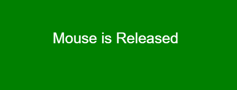

# P5 . js | Mouse | Mouse present

> 原文:[https://www.geeksforgeeks.org/p5-js-mouse-mouseispressed/](https://www.geeksforgeeks.org/p5-js-mouse-mouseispressed/)

p5.js 中的**mouse pressed**系统变量用于存储布尔值。如果按下鼠标，则存储为真，否则存储为假。

**语法:**

```
mouseIsPressed
```

下面的程序说明了 p5.js 中的 mouseIsPressed 变量:

**示例 1:** 本示例使用 mouseIsPressed 变量检查鼠标是否被按下。

```
function setup() {

    // Create canvas of given size
    createCanvas(500, 250);

    // Set the text size
    textSize(30); 
}

function draw() {

    // Set the background color
    background('green');

    fill('white');

    // If mouse is pressed then if part will 
    // execute otherwise else part will execute
    if (mouseIsPressed) {
        text("Mouse is Pressed", 120, 100);
    }
    else {
        text("Mouse is Released", 120, 100);
    }
}
```

**输出:**


**例 2:**

```
function setup() {

    // Create Canvas of given size
    createCanvas(300, 150);
}

function draw() {

    // Set the background color
    background('green');

    fill('white');

    // Use mouseIsPressed variable
    if (mouseIsPressed) {
        ellipse(50, 50, 50, 50);
    } 
    else {
        rect(25, 25, 50, 50);
    }
}
```

**输出:**

**参考:**[https://p5js.org/reference/#/p5/mouseIsPressed](https://p5js.org/reference/#/p5/mouseIsPressed)