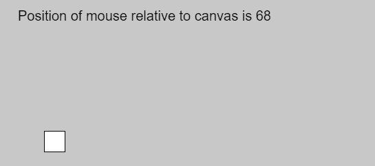
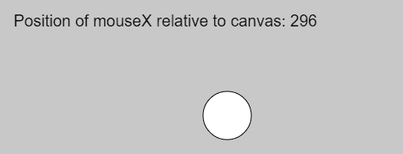

# p5.js | Mouse | mouseX

> 原文:[https://www.geeksforgeeks.org/p5-js-mouse-mousex/](https://www.geeksforgeeks.org/p5-js-mouse-mousex/)

p5.js 中的 mouseX 变量用于存储鼠标相对于画布(0，0)的当前水平位置。如果使用触摸代替鼠标输入，mouseX 将保存最近触摸点的 x 值。

**语法:**

```
mouseX
```

下面的程序说明了 p5.js 中的 mouseX 变量:

**示例 1:** 本示例使用 mouseX 变量显示位置。

```
function setup() {

    // Create canvas
    createCanvas(1000, 400);

    // Set the text size
    textSize(20); 
}

function draw() {

    // Set background color
    background(200);

    // Create rectangle
    rect(mouseX, height/2, 30, 30);

    // Display position
    text("Position of mouse relative to canvas is "
            + mouseX, 30, 40);
}
```

**输出:**


**示例 2:** 本示例使用 mouseX 变量显示位置。

```
function setup() {

    // Create canvas
    createCanvas(1000, 400);

    // Set font size
    textSize(20);
}

function draw() {

    // Set background color
    background(200);

    // Create circle
    circle(mouseX, mouseY, 30);

    // Display position
    text("Position of mouseX relative to canvas: "
            + mouseX, 30, 40);
}
```

**输出:**


**参考:**T2】https://p5js.org/reference/#/p5/mouseX