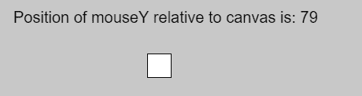
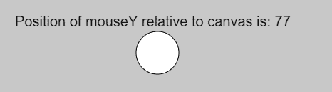

# p5.js | Mouse | mouseY

> 原文:[https://www.geeksforgeeks.org/p5-js-mouse-mousey/](https://www.geeksforgeeks.org/p5-js-mouse-mousey/)

p5.js 中的 **mouseY 变量**用于存储鼠标相对于画布(0，0)的当前垂直位置。如果使用触摸代替鼠标输入，mouseX 将保存最近触摸点的 y 值。

**语法:**

```
mouseY
```

下面的程序说明了 p5.js 中的 mouseY 变量:

**示例 1:** 本示例使用 mouseY 变量显示房屋的垂直位置。

```
function setup() {

    // Create canvas
    createCanvas(1000, 400);

    // Set the font size
    textSize(20);
}

function draw() {

    // Set background color
    background(200);

    // Create rectangle
    rect(height/2, mouseY, 30, 30);

    // Display position of mouse on Y-axis
    text("Position of mouseY relative to canvas is: "
            + mouseY, 30, 40);
}
```

**输出:**


**示例 2:** 本示例使用 mouseY 变量显示房屋的垂直位置。

```
function setup() {

    // Create canvas
    createCanvas(1000, 400);

    // Set the font size
    textSize(20);
}

function draw() {

    // Set background color
    background(200);

    // Create circle
    circle(mouseX, mouseY, 30);

    // Display position of mouse on Y-axis
    text("Position of mouseY relative to canvas is: "
            + mouseY, 30, 40);
}
```

**输出:**


**参考:**T2】https://p5js.org/reference/#/p5/mouseY