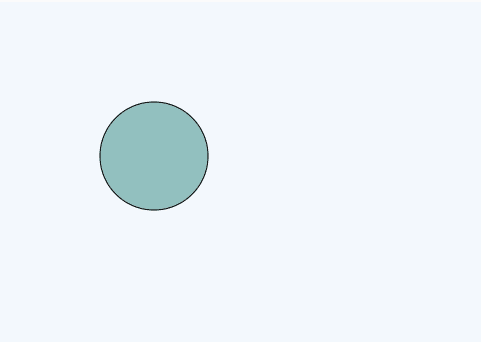
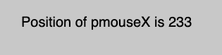

# p5.js | Mouse | pmouseX

> 哎哎哎:# t0]https://www . geeksforgeeks . org/P5-js-mouse-pmoux/

p5.js 中的 **pmouseX** 变量用于存储当前活动帧之前的帧中鼠标光标相对于画布原点的水平位置。

**语法:**

```
mouseX
```

下面的程序说明了 p5.js 中的 pmouseX 变量:

**示例 1:** 本示例使用 pmouseX 变量将鼠标指针绘制为圆形。

```
function setup() {

    // Create canvas
    createCanvas(1000, 400);
}

function draw() {

    // Set the background color
    background(244, 248, 252);

    // Fill color relative pmouseX,
    // pmouseY and mouseY
    fill(pmouseX%255, pmouseY%255, mouseY%255);

    // Draw circle 
    circle(pmouseX, mouseX, pmouseX%100);
}
```

**输出:**


**示例 2:** 本示例使用 pmouseX 变量显示鼠标指针的位置。

```
function setup() {

    // Create canvas
    createCanvas(1000, 400);

    // Set font size
    textSize(20);
}

function draw() {

    // Set background color
    background(200);

    // Display result
    text("Position of pmouseX is "
        + pmouseX, 30, 40);
}
```

**输出:**


**参考:**T2】https://p5js.org/reference/#/p5/pmouseX