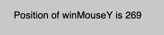
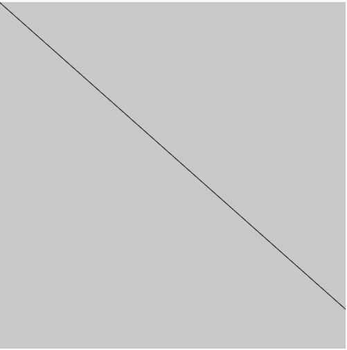

# p5.js | Mouse | winmouseY

> 原文:[https://www.geeksforgeeks.org/p5-js-mouse-winmousey/](https://www.geeksforgeeks.org/p5-js-mouse-winmousey/)

p5.js 中的 **winmouseY** 变量用于存储鼠标相对于窗口(0，0)的当前垂直位置。

**语法:**

```
winmouseY
```

下面的程序说明了 p5.js 中的 winmouseY 变量:

**示例 1:** 本示例使用 winmouseY 变量显示其位置。

```
function setup() {

    // Create canvas of given size
    createCanvas(1000, 400);

    // Set the text size
    textSize(20); 
}

function draw() {

    // Set the background color
    background(200);

    // Create rectangle
    rect(winMouseX, winMouseY, 10, 10);

    // Display winMouseY position
    text("Position of winMouseY is "
        + winMouseY, 30, 40);
}
```

**输出:**


**示例 2:** 本示例使用 winmouseY 变量显示内容。

```
function setup() {

    // Create canvas of given size
    createCanvas(500, 500);

    // Set the text size
    textSize(20); 
}

function draw() {

    // Set background color
    background(200);

    // Create circle
    circle(winMouseX, winMouseY, winMouseX-winMouseY);

    // Create line
    line(0, 0, windowWidth, windowHeight);

    // Check condition and display content
    if( winMouseX != winMouseY ) {
        text("You Lose", 12, 34);
  }
}
```

**输出:**


**参考:**T2】https://p5js.org/reference/#/p5/dwinmouseY