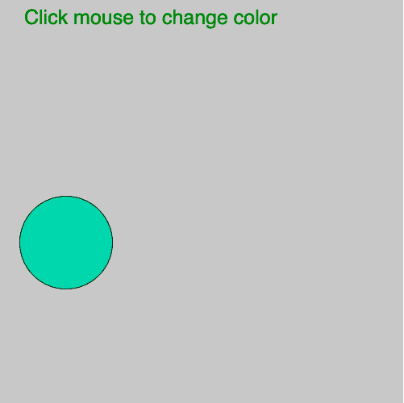
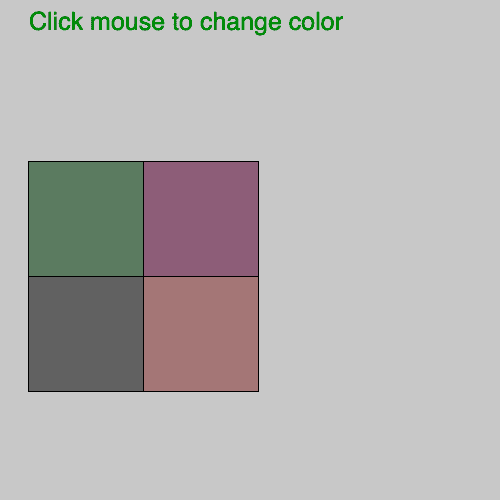

# p5.js mouseClicked()函数

> 原文:[https://www.geeksforgeeks.org/p5-js-mouseclicked-function/](https://www.geeksforgeeks.org/p5-js-mouseclicked-function/)

p5.js 中的 **mouseClicked()功能**在鼠标按键被按下和释放时工作。浏览器可能包含附加到各种鼠标事件的不同默认行为。要防止此事件的默认行为，请在方法的末尾添加“return false”。

**语法:**

```
mouseClicked(Event)
```

下面的程序说明了 p5.js 中的 mouseClicked()函数:

**示例 1:** 本示例说明了 mouseClicked()函数。

```
let valueX;
let valueY;

function setup() {

    // Create Canvas
    createCanvas(500, 500);
}

function draw() {

    // Set the background color
    background(200); 

    // SEt the filled color
    fill('green');

    // Set the font size
    textSize(25);

    text('Click mouse to change color', 30, 30);

    // Fill color according to mouseClicked() 
    fill(valueX, 255-valueY, 255-valueX);

    // Draw ellipse  
    ellipse(mouseX, mouseY, 115, 115);
}

function mouseClicked() {
    valueX = mouseX%255;
    valueY = mouseY%255;
}
```

**输出:**


**例 2:**

```
let valueX;
let valueY;

function setup() {

    // Create Canvas
    createCanvas(500, 500);
}

function draw() {

    // Set background color
    background(200); 

    fill('green');

    // Set font size
    textSize(25);

    text('Click mouse to change color', 30, 30);

    // Fill color according to mouseMoved() 
    fill(valueX, 255-valueY, 255-valueX);

    // Draw rectangle 
    rect(mouseX, mouseY, 115, 115);

    fill(valueY, 255-valueX, 255-valueX);

    rect(mouseX, mouseY+115, 115, 115);
    fill(255-valueY, 255-valueX, 255-valueY);

    rect(mouseX-115, mouseY, 115, 115);
    fill(255-valueY, 255-valueY, 255-valueY);

    rect(mouseX-115, mouseY+115, 115, 115);
}

function mouseReleased() {
    valueX = mouseX%255;
    valueY = mouseY%255;
}
```

**输出:**


**参考:**T2】https://p5js.org/reference/#/p5/mouseReleased