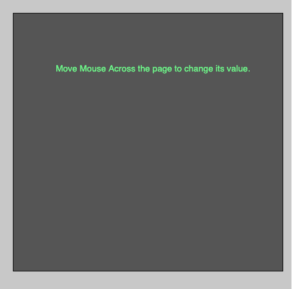
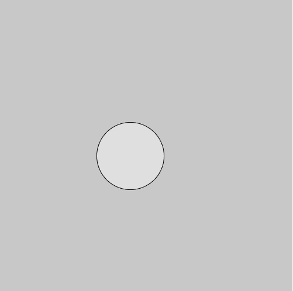

# p5.js mouseMoved()函数

> 原文:[https://www.geeksforgeeks.org/p5-js-mousemoved-function/](https://www.geeksforgeeks.org/p5-js-mousemoved-function/)

p5.js 中的 **mouseMoved()函数**在每次鼠标移动且没有按下鼠标按钮时被调用。

**语法:**

```
mouseMoved(Event)
```

**参数:**该功能接受单参数**事件**，可选。

下面的程序说明了 p5.js 中的 mouseMoved()函数:
**示例 1:** 本示例使用 mouseMoved()函数在鼠标移动到上方时改变矩形的颜色。

```
function setup() {

    // Create Canvas of size 500*500
    createCanvas(500, 500);
}

let value = 0;
function draw() {

    // SEt background color
    background(200);

    // Set the filled color
    fill(value);

    // Create rectangle of given size
    rect(25, 25, 460, 440);

    // Set the text color
    fill('lightgreen');

    // Set font size
    textSize(15);

    // Display the text
    text('Move Mouse Across the page to change its value.', 
             windowHeight/6, windowWidth/4);
}

function mouseMoved() {

    value = value + 5;

    if (value > 255) {
        value = 0;
    }
}
```

**输出:**


**示例 2:** 本示例使用 mouseMoved()函数更改椭圆的颜色。

```
// Declare a variable
let value;

function setup() {

    // Create Canvas of size 500*500
    createCanvas(500, 500);
}

function draw() {

    // Set background color
    background(200); 

    // fill color according to 
    // mouseMoved() function

    // Set the color
    fill(value, value, value);

    // Draw ellipse  
    ellipse(mouseX, mouseY, 115, 115);
}

function mouseMoved() {
    value = mouseX%255;
}
```

**输出:**


**参考:**T2】https://p5js.org/reference/#/p5/mouseMoved