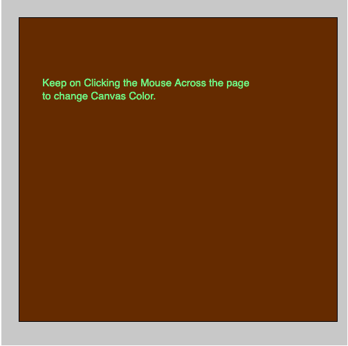
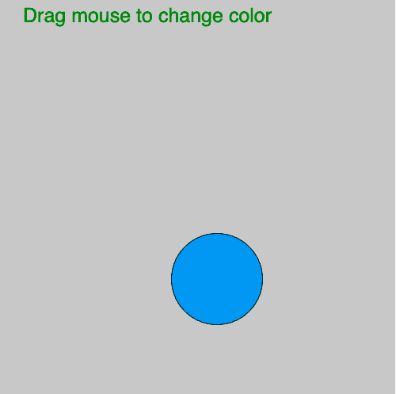

# p5.js mouseReleased()函数

> 原文:[https://www.geeksforgeeks.org/p5-js-mousereleased-function/](https://www.geeksforgeeks.org/p5-js-mousereleased-function/)

p5.js 中的 **mouseReleased()功能**在鼠标按钮释放时工作。当没有定义 mouseReleased()函数时，使用**touch end()**函数代替 mouseReleased()函数。

**语法:**

```
mouseReleased(Event)
```

下面的程序说明了 p5.js 中的 mouseReleased()函数:

**示例 1:** 本示例使用 mouseReleased()函数更改背景颜色。

```
function setup() {

    // Create Canvas
    createCanvas(500, 500);
}

let value = 0;

function draw() {

    // Set the background color
    background(200);

    // Fill the color
    fill(value, value-50, value-100);

    // Create rectangle
    rect(25, 25, 460, 440);

    // Set the filled color
    fill('lightgreen');

    // Set the font size
    textSize(15);

    // Display result
    text('Keep on Clicking the Mouse Across'
        + ' the page \nto change Canvas Color.',
        windowHeight/10, windowWidth/4);
}

function mouseReleased() {
    value = value + 5;

    if (value > 255) {
        value = 0;
    }
}
```

**输出:**


**示例 2:** 本示例使用 mouseReleased()函数更改鼠标指针颜色。

```
let valueX;
let valueY;

function setup() {

    // Create Canvas
    createCanvas(500, 500);
}

function draw() {

    // Set background color
    background(200); 

    // Fill the color
    fill('green');

    // Set font size
    textSize(25);

    text('Drag mouse to change color', 30, 30);

    // Fill color according to mouseMoved() 
    fill(valueX, 255-valueY, 255-valueX);

    // Draw ellipse  
    ellipse(mouseX, mouseY, 115, 115);
}

function mouseReleased() {
    valueX = mouseX%255;
    valueY = mouseY%255;
}
```

**输出:**


**参考:**T2】https://p5js.org/reference/#/p5/mouseReleased