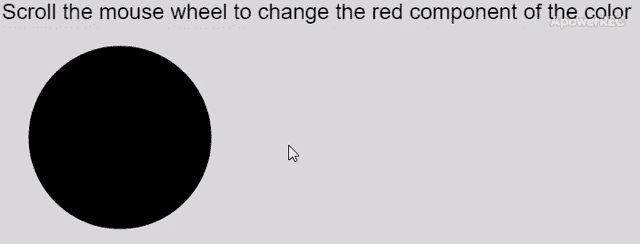

# p5.js | mouseWheel()功能

> 原文:[https://www.geeksforgeeks.org/p5-js-mousewheel-function/](https://www.geeksforgeeks.org/p5-js-mousewheel-function/)

每当鼠标或触摸板滚动导致垂直鼠标滚轮事件时，就会调用**鼠标滚轮()**功能。可以访问该事件来确定滚动的属性。delta 属性返回发生的滚动量。该值可以是正值或负值，具体取决于滚动方向。

回调函数可能必须以“return false”结尾语句来防止可能与不同浏览器上的滚动相关联的任何默认行为。

**语法:**

```
mouseWheel( event )
```

**参数:**该函数接受如上所述的单个参数，如下所述:

*   **事件:**这是一个可选的 WheelEvent 回调参数，可以用来访问滚动细节。

下面的例子说明了 p5.js 中的 **mouseWheel()函数**:

**示例 1:** 使用滚动事件改变滚动时的颜色

```
let red = 0;

function setup() {
    createCanvas(750, 300);
    textSize(24);
}

function draw() {
    clear();

    // Apply fill based on the
    // red component
    fill(red, 0, 0)

    text("Scroll the mouse wheel to "
            + "change the red component"
            + " of the color", 20, 20);

    circle(150, 150, 200);
}

function mouseWheel(event) {

    // Change the red value according
    // to the scroll delta value
  red += event.delta;
}
```

**输出:**


**示例 2:** 显示滚动属性

```
let scrollDelta = 0;

function setup() {
    createCanvas(500, 200);
    textSize(24);
    text("Scroll the mouse to see the"
        + " scroll details.", 10, 20);
}

function mouseWheel(event) {
    scrollDelta = event.delta;

    clear();
    deltaString = "Current mouse delta is: "
                    + scrollDelta;

    text(deltaString, 10, 20);

    if (scrollDelta > 0) {
        text("You are scrolling downwards", 10, 40);
    } 
    else {
        text("You are scrolling upwards", 10, 40);
    }
}
```

**输出:**


**在线编辑:**[【https://editor.p5js.org/】](https://editor.p5js.org/)
**环境设置:**[https://www . geeksforgeeks . org/P5-js-soundfile-object-installation-and-methods/](https://www.geeksforgeeks.org/p5-js-soundfile-object-installation-and-methods/)

**参考:**T2】https://p5js.org/reference/#/p5/mouseWheel