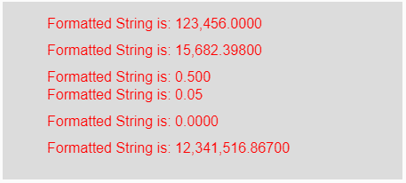
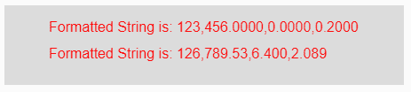

# p5.js | nfc()功能

> 原文:[https://www.geeksforgeeks.org/p5-js-nfc-function/](https://www.geeksforgeeks.org/p5-js-nfc-function/)

p5.js 中的 **nfc()函数**用于将输入的数字(整数或浮点数)格式化为字符串，并放置适当的逗号(，)来标记 1000 的单位。它包含两个版本，第一个用于格式化整数，第二个用于格式化整数数组。

**语法:**

```
nfc( Num, Right )
```

**参数:**该函数接受两个参数，如上所述，如下所述:

*   **Num:** 此参数保存要格式化的数字或字符串或数字数组，并放置适当的逗号(，)来标记 1000 的单位。
*   **右:**这是正数，表示位数应该在小数点右边。

**返回值:**返回格式化的字符串。

下面的程序说明了 p5.js 中的 nfc()功能:

**示例 1:** 本示例使用 nfc()函数将输入的数字格式化为字符串，并放置适当的逗号来标记 1000 的单位。

```
function setup() { 

    // Creating Canvas size
    createCanvas(450, 200); 
} 

function draw() { 

    // Set the background color 
    background(220); 

    // Initializing the Numbers
    let num1 = 123456; 
    let num2 = 15682.398; 
    let num3 = .5; 
    let num4 = .05; 
    let num5 = 0; 
    let num6 = 12341516.867; 

    // Calling to nfc() function
    let A = nfc(num1, 4);
    let B = nfc(num2, 5);
    let C = nfc(num3, 3);
    let D = nfc(num4, 2);
    let E = nfc(num5, 4);
    let F = nfc(num6, 5);

    // Set the size of text 
    textSize(16); 

    // Set the text color 
    fill(color('red')); 

    // Getting formatted String
    text("Formatted String is: " + A, 50, 30);
    text("Formatted String is: " + B, 50, 60);
    text("Formatted String is: " + C, 50, 90);
    text("Formatted String is: " + D, 50, 110);
    text("Formatted String is: " + E, 50, 140);
    text("Formatted String is: " + F, 50, 170);
} 
```

**输出:**


**示例 2:** 本示例使用 nfc()函数将输入的数字格式化为字符串，并放置适当的逗号来标记 1000 的单位。

```
function setup() { 

    // Creating Canvas size
    createCanvas(450, 90); 
} 

function draw() { 

    // Set the background color 
    background(220); 

    // Initializing the array of numbers
    let num1 = [123456, 0, .2]; 
    let num2 = [126789.53, 6.4, 2.0894]; 

    // Calling to nfc() function
    let A = nfc(num1, 4);
    let B = nfc(num2, 3);

    // Set the size of text 
    textSize(16); 

    // Set the text color 
    fill(color('red')); 

    // Getting formatted String
    text("Formatted String is: " + A, 50, 30);
    text("Formatted String is: " + B, 50, 60);
} 
```

**输出:**


**参考:**T2】https://p5js.org/reference/#/p5/nfc