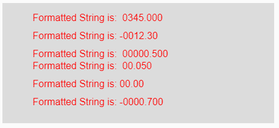
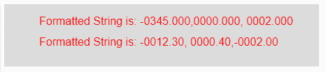

# p5.js | nfs()功能

> 原文:[https://www.geeksforgeeks.org/p5-js-nfs-function/](https://www.geeksforgeeks.org/p5-js-nfs-function/)

p5.js 中的 **nfs()函数**用于将输入数字(整数或浮点数)格式化为字符串，并在正输入数字前添加“”(空格)，在负输入数字前添加负号(-)。此功能在对齐时使用。

**语法:**

```
nfs(Num, Left, Right)
```

**参数:**该功能接受三个参数，如上所述，描述如下:

*   **Num:** 这是要格式化的输入正数或数字数组。
*   **左:**这是正数，表示位数应该在小数点左边。
*   **右:**这是正数，表示位数应该在小数点右边。

**返回值:**返回格式化的字符串。

下面的程序说明了 p5.js 中的 nfs()函数:

**示例 1:** 本示例使用 nfs()函数格式化输入数字，并在正数前添加单个空格以设置对齐。

```
function setup() { 

    // Creating Canvas size
    createCanvas(450, 200); 
} 

function draw() { 

    // Set the background color 
    background(220); 

    // Initializing the Numbers
    let num1 = 345; 
    let num2 = -12.3; 
    let num3 = .5; 
    let num4 = .05; 
    let num5 = 0; 
    let num6 = -0.7; 

    // Calling to nfs() function.
    let A = nfs(num1, 4, 3);
    let B = nfs(num2, 4, 2);
    let C = nfs(num3, 5, 3);
    let D = nfs(num4, 2, 3);
    let E = nfs(num5, 2, 2);
    let F = nfs(num6, 4, 3);

    // Set the size of text 
    textSize(16); 

    // Set the text color 
    fill(color('red')); 

    // Getting formatted String
    text("Formatted String is: " + A, 50, 30);
    text("Formatted String is: " + B, 50, 60);
    text("Formatted String is: " + C, 50, 90);
    text("Formatted String is: " + D, 50, 110);
    text("Formatted String is: " + E, 50, 140);
    text("Formatted String is: " + F, 50, 170);
} 
```

**输出:**


**示例 2:** 本示例使用 nfs()函数格式化输入数字，并在正数前添加空格以设置对齐。

```
function setup() { 

    // Creating Canvas size
    createCanvas(450, 90); 
} 

function draw() { 

    // Set the background color 
    background(220); 

    // Initializing the array of numbers
    let num1 = [-345, 0, 2]; 
    let num2 = [-12.3, .4, -2.0]; 

    // Calling to nfs() function.
    let A = nfs(num1, 4, 3);
    let B = nfs(num2, 4, 2);

    // Set the size of text 
    textSize(16); 

    // Set the text color 
    fill(color('red')); 

    // Getting formatted String
    text("Formatted String is: " + A, 50, 30);
    text("Formatted String is: " + B, 50, 60);
} 
```

**输出:**


**参考:**T2】https://p5js.org/reference/#/p5/nfs