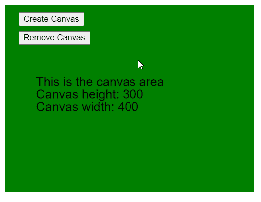

# p5.js | noCanvas()功能

> 原文:[https://www.geeksforgeeks.org/p5-js-nocanvas-function/](https://www.geeksforgeeks.org/p5-js-nocanvas-function/)

p5.js 中的 **noCanvas()函数**用于移除 p5.js 创建的默认画布，这可以用于不需要画布的草图。它不接受任何参数。

**语法:**

```
noCanvas()
```

**参数:**此功能不接受参数。

下面的程序说明了 p5.js 中的 **noCanvas()** 功能:

**示例:**

```
function setup() {
  createCanvas(400, 300);

  // Create buttons for creating
  // and removing the canvas
  createBtn = createButton("Create Canvas");
  createBtn.position(30, 20);
  createBtn.mouseClicked(createDrawArea);

  removeBtn = createButton("Remove Canvas");
  removeBtn.position(30, 50);
  removeBtn.mouseClicked(removeDrawArea);
}

function removeDrawArea() {

  // Wrap noCanvas() in a try-catch
  // to prevent error in case there
  // exists no canvas to remove
  try {
    noCanvas();
  } catch (e) {
    print("No canvas found to remove");
    print(e);
  }
}

function createDrawArea() {

  // Create a canvas with the
  // given dimensions
  createCanvas(400, 300);
}

function draw() {
  clear();
  background("green");
  textSize(20);

  text("This is the canvas area", 50, 130);
  text("Canvas height: " + height, 50, 150);
  text("Canvas width: " + width, 50, 170);
}
```

**输出:**



**参考:**T2】https://p5js.org/reference/#/p5/noCanvas