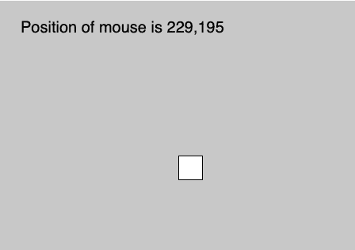
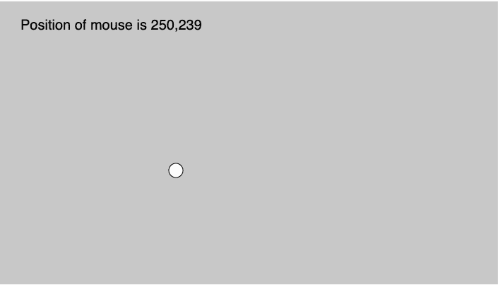

# p5.js | noCursor()功能

> 原文:[https://www.geeksforgeeks.org/p5-js-nocursor-function/](https://www.geeksforgeeks.org/p5-js-nocursor-function/)

p5.js 中的 **noCursor()功能**用于*隐藏光标不可见*。
**语法**

```
noCursor()

```

**参数:**此功能不接受任何参数。

下面程序举例说明了【p5.js:
**中 **noCursor()函数**示例-1:**

```
function setup() {

  createCanvas(1000, 400);

  // Set text size to 40px
  textSize(20); 

  // Call to noCursor() function
  noCursor(); 
}

function draw() {
 background(200);
 rect(mouseX, mouseY, 30, 30);
  text("Position of mouse is "
  +mouseX+", "+mouseY, 30, 40);
}
```

**输出:**


**示例-2:**

```
function setup() {

  createCanvas(1000, 400);

  // Set text size to 40px
  textSize(20); 

  // Call to noCursor() function
  noCursor(); 
}

function draw() {
 background(200);
 circle(mouseX, mouseY, 10);
  text("Position of mouse is "
  +mouseX+", "+mouseY, 30, 40);
}
```

**输出:**


**参考:**T2】https://p5js.org/reference/#/p5/noCursor