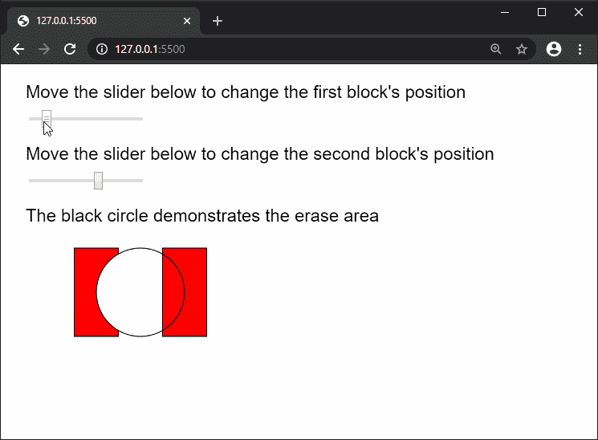

# p5.js | noErase()功能

> 原文:[https://www.geeksforgeeks.org/p5-js-noerase-function/](https://www.geeksforgeeks.org/p5-js-noerase-function/)

p5.js 中的 **noErase()功能**用于取消 Erase()功能的效果。它会将 fill()、stroke()和 blendMode()函数的功能恢复到使用 erase()之前的状态。在此功能之后完成的任何绘图都将正常绘制。

**语法:**

```
noErase()
```

**参数:**此功能不接受任何参数。

下面的例子说明了 p5.js 中的 **noErase()函数**:

**示例:**

```
function setup() {
    createCanvas(600, 400);
    textSize(20);
    firstBlockSlider = createSlider(50, 250, 75, 1);
    firstBlockSlider.position(30, 50);

    secondBlockSlider = createSlider(50, 250, 175, 1);
    secondBlockSlider.position(30, 120);
}

function draw() {
    clear();
    fill('black');
    text("Move the slider below to change the"
        + " first block's position", 20, 30);
    text("Move the slider below to change the"
        + " second block's position", 20, 100);
    text("The black circle demonstrates the"
        + " erase area", 20, 170);

    fill('red');
    rect(firstBlockSlider.value(), 200, 50, 100);

    // Start erasing with erase()
    erase();
    circle(150, 250, 100);

    // Stop erasing with noErase()
    noErase();

    fill('red');
    rect(secondBlockSlider.value(), 200, 50, 100);

    // Circle to illustrate the erase position
    noFill();
    circle(150, 250, 100);
}
```

**输出:**


**环境设置:**

**参考:**T2】https://p5js.org/reference/#/p5/noErase