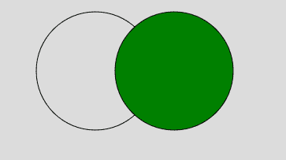

# p5.js | noFill()函数

> 原文:[https://www.geeksforgeeks.org/p5-js-nofill-function/](https://www.geeksforgeeks.org/p5-js-nofill-function/)

**无填充()功能**用于禁用填充几何图形。如果同时调用 noStroke()和 noFill()函数，那么屏幕上将不会绘制任何内容。

**语法:**

```
noFill()
```

**参数:**此功能不接受任何参数。

下面的例子说明了 p5.js 中的 noFill()函数:

**例 1:**

```
function setup() { 

    // Create Canvas of given size 
    createCanvas(400, 300); 
} 

function draw() { 

    // Set the background color 
    background(220); 

    // Use fill() function to fill color
    fill('green')
    // Draw a line 
    rect(50, 50, 150, 150); 

    // Use noFill() function
    noFill();

    // Draw a line 
    rect(100, 100, 150, 150); 
} 
```

**输出:**


**例 2:**

```
function setup() { 

    // Create Canvas of given size 
    createCanvas(400, 300); 
} 

function draw() { 

    // Set the background color 
    background(220); 

    // Use noFill() function
    noFill();

    // Draw a line 
    circle(140, 100, 150);

    // Use fill() function to fill color
    fill('green')
    // Draw a line 
    circle(240, 100, 150); 
} 
```

**输出:**


**参考:**T2】https://p5js.org/reference/#/p5/nofill