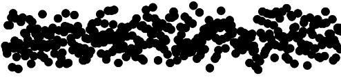
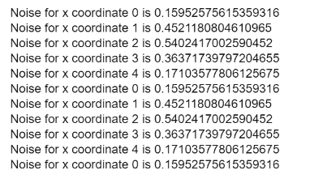
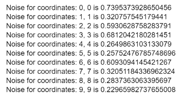

# p5.js | noise()功能

> 原文:[https://www.geeksforgeeks.org/p5-js-noise-function/](https://www.geeksforgeeks.org/p5-js-noise-function/)

**noise()函数**用于返回给定坐标下由柏林噪声产生的数字。该值是半随机的，这意味着在程序的生命周期内，坐标的值是固定的。

柏林噪声值不同于 **[随机()函数](https://www.geeksforgeeks.org/p5-js-random-function/)** 返回的值，因为与标准噪声相比，这种噪声具有更自然和更和谐的连续性。

**语法:**

```
noise(x, [y], [z])
```

**参数:**该函数接受三个参数，如上所述，如下所述:

*   **x:** 这是一个代表噪声空间中 x 坐标的数字。
*   **y:** 这是一个代表噪声空间中 y 坐标的数字。这是一个可选参数。
*   **z:** 这是一个代表噪声空间中 z 坐标的数字。这是一个可选参数。

**返回值:**返回 0 到 1 之间的柏林噪声值。

下面的例子说明了 p5.js 中的 **noise()函数**:

**例 1:** 绘制移动点 y 坐标的噪声值。

*   **程序:**

    ```
    let x_coordinate = 100.0;
    let plot_x = 10.0;

    function setup() {
        createCanvas(400, 200);
    }

    function draw() {

        // Get noise with x coordinate
        x_noise = noise(x_coordinate) * 100;

        // Plot the point with random noise
        strokeWeight(10);
        point(plot_x, x_noise);

        // Increment the x coordinate
        x_coordinate++;

        // Increase the x coordinate
        // for plotting
        plot_x++;
    }
    ```

*   **输出:**
    

**例 2:** 这个例子演示了函数的半随机性质。

*   **程序:**

    ```
    let x_coordinate = 0.0;
    let plot_y = 0.0;

    function setup() {
        createCanvas(400, 200);
    }

    function draw() {

        if (x_coordinate < 5) {

            // Get noise with x coordinate
            x_noise = noise(x_coordinate);

            // Output the noise along with
            // its corresponding coordinate
            coord_text = "Noise for x coordinate "
                + x_coordinate + " is " + x_noise;

            text(coord_text, 10, plot_y);

            // Increment the x coordinate
            x_coordinate++;

            // Increase the y coordinate
            // for plotting
            plot_y = plot_y + 15;
        }
        else
            x_coordinate = 0;
    }
    ```

*   **输出:**
    

**示例 3:** 该示例使用两个参数来定义噪声空间中的一个点。

*   **程序:**

    ```
    let x_coordinate = 0.0;
    let y_coordinate = 0.0;
    let plot_y = 0.0;

    function setup() {
        createCanvas(400, 200);
    }

    function draw() {

        if (x_coordinate < 10) {

            // Get noise with x and y coordinates
            xy_noise = noise(x_coordinate, y_coordinate);

            // Output the noise along with
            // its corresponding coordinate
            coord_text = "Noise for coordinates: "
                + x_coordinate + ", " + y_coordinate
                + " is " + xy_noise;
            text(coord_text, 10, plot_y);

            // Increment the x and y
            // coordinates
            x_coordinate++;
            y_coordinate++;

            // Increase the y coordinate
            // for plotting
            plot_y = plot_y + 15;
        }
    }
    ```

*   **输出:**
    

**在线编辑:**[【https://editor.p5js.org/】](https://editor.p5js.org/)
**环境设置:**[https://www . geeksforgeeks . org/P5-js-soundfile-object-installation-and-methods/](https://www.geeksforgeeks.org/p5-js-soundfile-object-installation-and-methods/)

**参考:**T2】https://p5js.org/reference/#/p5/noise