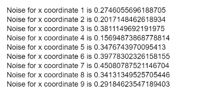

# p5.js | noiseSeed()功能

> 原文:[https://www.geeksforgeeks.org/p5-js-noiseseed-function/](https://www.geeksforgeeks.org/p5-js-noiseseed-function/)

**噪声种子()**功能用于设置**噪声()功能**的种子值。**噪波()函数**默认返回一个半随机的数字，这意味着只有在程序运行之前，一个坐标的噪波值才是相同的。下次运行该程序将产生不同的值。

通过在程序中设置一个不变的种子值，可以使这些噪声值保持不变，这样每次运行程序时，它都会返回相同的值。

**语法:**

```
noiseSeed( seed )
```

**参数:**该函数接受如上所述的单个参数，如下所述:

*   **种子:**该参数保存一个代表种子值的数字。

**返回值:**该函数不返回值。

下面的例子说明了 p5.js 中的 **noiseSeed()函数**:

**示例:**

```
let x_coordinate = 0.0;
let plot_y = 0.0;

function setup() {
    createCanvas(400, 200);
}

function draw() {

    // Specifying a noise seed value
    noiseSeed(100);

    if (x_coordinate < 10) {

        // Get noise with x coordinate
        x_noise = noise(x_coordinate);

        // Output the noise along with
        // its corresponding coordinate
        coord_text = "Noise for x coordinate "
            + x_coordinate + " is " + x_noise;

        text(coord_text, 10, plot_y);

        // Increment the x coordinate
        x_coordinate++;

        // Increase the y coordinate
        // for plotting
        plot_y = plot_y + 15;
    }
}
```

**输出:**每次运行程序时，这些值都是恒定的。

*   **首次运行程序:**
    
*   **第二次运行程序:**
    

**在线编辑:**[【https://editor.p5js.org/】](https://editor.p5js.org/)
**环境设置:**[https://www . geeksforgeeks . org/P5-js-soundfile-object-installation-and-methods/](https://www.geeksforgeeks.org/p5-js-soundfile-object-installation-and-methods/)

**参考:**T2】https://p5js.org/reference/#/p5/noiseSeed