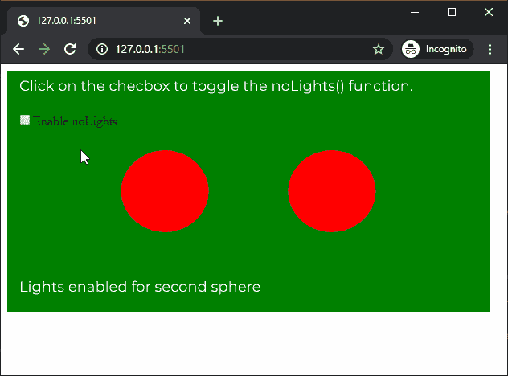
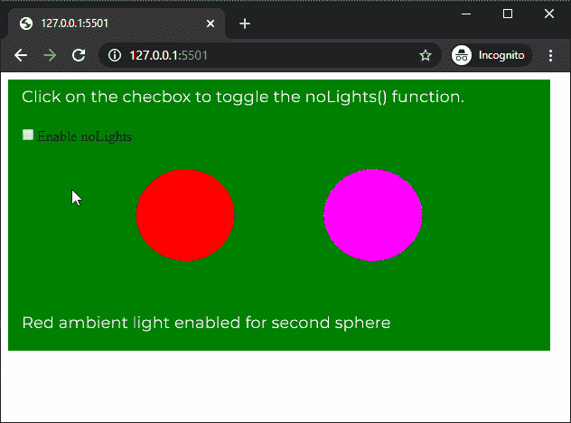

# P5 . js | nollights()功能

> 原文:[https://www.geeksforgeeks.org/p5-js-nolights-function/](https://www.geeksforgeeks.org/p5-js-nolights-function/)

p5.js 中的 **noLights()函数**用于移除草图中的所有灯光，以便在该函数之后渲染材质。此后对灯光功能的任何调用都将再次启用草图中的灯光。

**语法:**

```
noLights()
```

**参数:**此功能不接受任何参数。

下面的例子说明了 p5.js 中的 **noLights()函数**:

**例 1:**

```
let newFont;
let nolightsEnable = false;

function preload() {
  newFont = loadFont('fonts/Montserrat.otf');
}

function setup() {
  createCanvas(600, 300, WEBGL);
  textFont(newFont, 18);

  nolightsEnableCheck = createCheckbox(
        "Enable noLights", false);

  nolightsEnableCheck.position(20, 60);

  // Toggle default light
  nolightsEnableCheck.changed(() => {
    nolightsEnable = !nolightsEnable;
  });
}

function draw() {
  background("green");
  text("Click on the checbox to toggle the "
       + "noLights() function.", -285, -125);
  noStroke();

  // Ambient light with red color
  ambientLight('red');

  // First sphere in the sketch
  translate(-100, 0, 0);
  sphere(50);

  translate(100, 0, 0);

  // If checkbox is enabled
  if (nolightsEnable) {

    // Disable all lights after this
    noLights();

    text("Lights disabled for second"
          + " sphere", -285, 125);
  }
  else {
    text("Lights enabled for second"
          + " sphere", -285, 125);
  }

  // Second sphere in the sketch
  translate(100, 0, 0);
  sphere(50);
}
```

**输出:**


**例 2:**

```
let newFont;
let nolightsEnable = false;

function preload() {
  newFont = loadFont('fonts/Montserrat.otf');
}

function setup() {
  createCanvas(600, 300, WEBGL);
  textFont(newFont, 18);

  nolightsEnableCheck = createCheckbox(
           "Enable noLights", false);

  nolightsEnableCheck.position(20, 60);

  // Toggle default light
  nolightsEnableCheck.changed(() => {
    nolightsEnable = !nolightsEnable;
  });
}

function draw() {
  background("green");
  text("Click on the checbox to toggle the"
    + " noLights() function.", -285, -125);
  noStroke();

  // Ambient light with red color
  ambientLight('red');

  // First sphere in the sketch
  translate(-100, 0, 0);
  sphere(50);

  translate(100, 0, 0);

  // If checkbox is enabled
  if (nolightsEnable) {

    // Disable all lights after this
    noLights();

    text("Red ambient light disabled for"
        + " second sphere", -285, 125);
  }
  else {
    text("Red ambient light enabled for"
        + " second sphere", -285, 125);
  }

  ambientLight('blue');

  // Second sphere in the sketch
  translate(100, 0, 0);
  sphere(50);
}
```

**输出:**


**在线编辑:**[https://editor.p5js.org/](https://editor.p5js.org/)

**环境设置:**

**参考:**T2】https://p5js.org/reference/#/p5/noLights