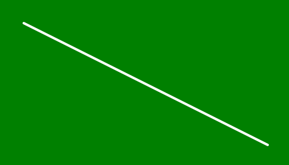

# p5.js | noLoop()函数

> 原文:[https://www.geeksforgeeks.org/p5-js-noloop-function/](https://www.geeksforgeeks.org/p5-js-noloop-function/)

**noLoop()功能**用于执行 draw()功能后停止程序。loop()函数一次又一次地运行 draw()函数。如果在 setup()函数中使用了 noLoop()函数，那么它应该是块内的最后一行。如果使用 noLoop()函数，则无法在事件处理函数(如 mousePressed()或 keyPressed()中更改或访问屏幕。

**语法:**

```
noLoop()
```

下面的例子说明了 p5.js 中的 noLoop()函数:

**例 1:**

```
function setup() {

  // Create canvas of given size
  createCanvas(500, 300);

  // Set the background color
  background('green');

  // Use noLoop() function
  noLoop();
}

function draw() {

  // Set the stroke color
  stroke('white');

  // Set the stroke width
  strokeWeight(4);

  // Function to draw the line
  line(50, 50, 450, 250);

}
```

**输出:**


**例 2:**

```
let l = 0;

function setup() {

  // Create canvas of given size
  createCanvas(500, 300);

  // Set the background color
  background('green');

}

function draw() {

  // Set the stroke color
  stroke('white');

  l = l + 0.5;
  if (l > width) {
    l = 0;
  }

  // Function to draw the line
  line(l, 0, l, height);

}

function mousePressed() {
  noLoop();
}

function mouseReleased() {
  loop();
}
```

**输出:**
