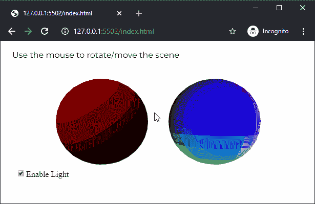
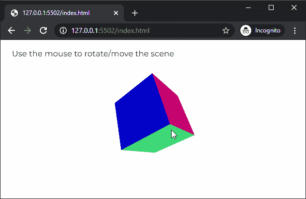

# p5.js | normalMaterial()函数

> 原文:[https://www . geesforgeks . org/P5-js-normal material-function/](https://www.geeksforgeeks.org/p5-js-normalmaterial-function/)

p5.js 中的 **normalMaterial()函数**用于为对象创建一个法线材质。正常的材料不受任何光的影响，也不反射任何光。面向 x 轴的表面变为红色，面向 y 轴的表面变为绿色，面向 z 轴的表面变为蓝色。它通常用作调试的占位符材料。

**语法:**

```
normalMaterial()
```

**参数:**此功能不接受任何参数。

下面的例子说明了 p5.js 中的 **normalMaterial()函数**:

**例 1:** 这个例子说明了正常物质不受光的影响。

```
let newFont;
let hasLight = true;

function preload() {
  newFont = loadFont('fonts/Montserrat.otf');
}

function setup() {
  createCanvas(600, 300, WEBGL);
  textFont(newFont, 16);

  lightCheckbox = createCheckbox('Enable Light', true);
  lightCheckbox.position(30, 250);
  lightCheckbox.changed(() => hasLight = !hasLight);
}

function draw() {
  background('white');
  fill('black');

  text("Use the mouse to rotate/move the scene", -285, -125);
  noStroke();
  orbitControl();

  // Enable lights when the checkbox is checked
  if (hasLight)
    directionalLight(color('red'), height / 2, width / 2, -250);

  // Draw the sphere which uses ambient material
  ambientMaterial(255);
  translate(-100, 0, 0);
  sphere(80);
  translate(100, 0, 0);

  // Draw sphere which uses normal material
  normalMaterial();
  translate(100, 0, 0);
  sphere(80);
  translate(-100, 0, 0);
}
```

**输出:**


**示例 2:** 该示例显示了法线材质不同轴的颜色。

```
let newFont;
let hasNormalMaterial = true;

function preload() {
  newFont = loadFont('fonts/Montserrat.otf');
}

function setup() {
  createCanvas(600, 300, WEBGL);
  textFont(newFont, 16);
}

function draw() {
  background('white');
  fill('black');

  text("Use the mouse to rotate/move the scene", -285, -125);
  // text("Select directional light color", -285, -100);
  shininess(10);
  noStroke();
  orbitControl();

  // Use the normal material
  normalMaterial();

  // Create the box
  rotateX(60)
  rotateY(120)
  rotateZ(60)
  box(100);
}
```

**输出:**


**在线编辑:**[https://editor.p5js.org/](https://editor.p5js.org/)

**环境设置:**

**参考:**T2】https://p5js.org/reference/#/p5/normalMaterial