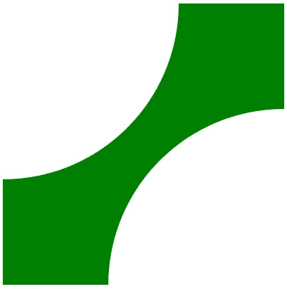
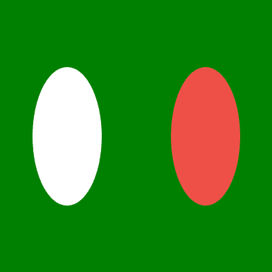

# p5.js noSmooth()功能

> 原文:[https://www.geeksforgeeks.org/p5-js-nosmooth-function/](https://www.geeksforgeeks.org/p5-js-nosmooth-function/)

在 p5.js 中所有的图像、字体、形状等。默认情况下被设置为 [smooth()](https://www.geeksforgeeks.org/p5-js-smooth-function/) ，除了 3D 模型，默认情况下没有激活的 noSmooth()。正如我们所知，smooth()函数平滑列出的元素的边缘。因此，相反地，noSmooth()函数限制了元素边缘的平滑。

平滑边缘需要一些时间。所以，如果你想更快地运行你的 p5.js 草图，并且你不太关心视觉效果。可以使用 noSmooth()函数。

**语法:**

```
noSmooth();
```

**参数:**noSmooth()函数不接受任何参数。

**例 1:**

## java 描述语言

```
function setup() {

    // Create canvas of 400X400 px
    createCanvas(400, 400);
}

function draw() {

    // Set background color to green
    background('green');

    // No border to shapes
    noStroke();

    smooth(); // by Default
    ellipse(0, 0, 500, 500);

    noSmooth();
    ellipse(400, 400, 500, 500);
}
```

**输出:**上椭圆光滑，下椭圆无光滑



**例 2:**

## java 描述语言

```
function setup() {

    // Create canvas of 400X400 px
    createCanvas(400, 400);
}

function draw() {

    // Set background color to green
    background('green');

    // No border to shapes
    noStroke();

    push();
    smooth(); // by Default
    ellipse(100, width / 2, 100, 200);
    pop();

    push();
    noSmooth(); // apply noSmooth()
    fill(238, 80, 71); // red color
    ellipse(300, width / 2, 100, 200);
    pop();
}
```

**输出:**

