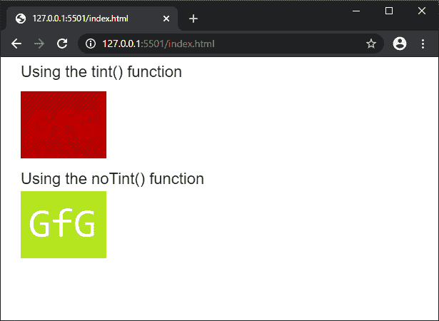
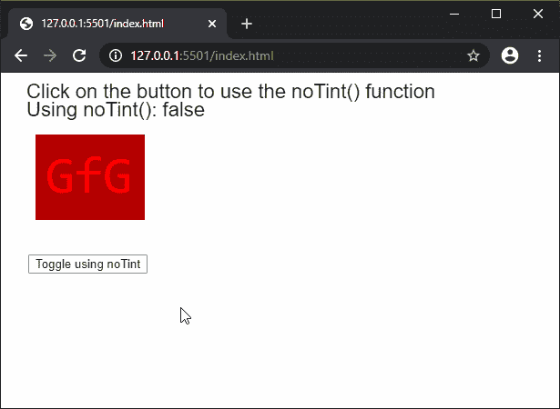

# p5.js | noTint()功能

> 原文:[https://www.geeksforgeeks.org/p5-js-notint-function/](https://www.geeksforgeeks.org/p5-js-notint-function/)

**noTint()** 功能用于移除之前使用**色调()**功能应用的图像的填充值。它将恢复图像的色调，并以原始色调显示它们。

**语法:**

```
noTint()
```

**参数:**此功能不接受任何参数。

下面的例子说明了 p5.js 中的 **noTint()函数**:

**例 1:**

```
function preload() {
  img = loadImage('sample-image.png');
}

function setup() {
  createCanvas(600, 300);
  textSize(22);
}

function draw() {
  clear();
  text("Using the tint() function", 20, 20);
  tint("red");
  image(img, 20, 40);

  text("Using the noTint() function", 20, 170);
  noTint()
  image(img, 20, 180);
}
```

**输出:**


**例 2:**

```
function preload() {
  img = loadImage('sample-image.png');
  disableTint = false;
}

function setup() {
  createCanvas(600, 300);
  textSize(22);

  // Create a button for toggling the
  // noTint() function
  removeBtn = createButton("Toggle using noTint");
  removeBtn.position(30, 200)
  removeBtn.mousePressed(removeTint);
}

function draw() {
  clear();
  text("Click on the button to use the noTint() function", 20, 20);
  text("Using noTint(): " + disableTint, 20, 40);

  // Check if the boolean value is true
  // to use the noTint() function
  // in this draw loop
  if (disableTint) noTint();

  image(img, 30, 60);

  // Using the tint() function here
  // would tint the image in the next
  // draw loop
  tint("red");
}

function removeTint() {
  // Toggle the use of noTint()
  disableTint = !disableTint;
}
```

**输出:**


**在线编辑:**[https://editor.p5js.org/](https://editor.p5js.org/)

**环境设置:**

**参考:**T2】https://p5js.org/reference/#/p5/notint