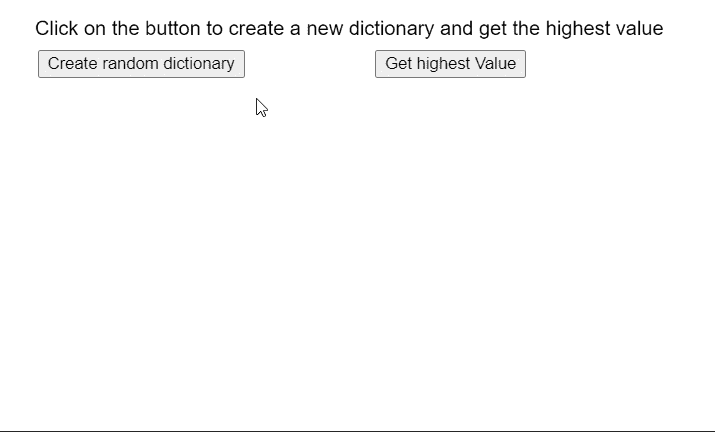

# p5.js NumberDict maxValue()方法

> 原文:[https://www . geesforgeks . org/P5-js-numberdict-maxvalue-method/](https://www.geeksforgeeks.org/p5-js-numberdict-maxvalue-method/)

p5 的 **maxValue()** **法**。p5.js 中的 NumberDict 用于查找数字字典中的最高值。一个数字字典可以存储多个键值对。

**语法:**

```
maxValue()
```

**参数:**此方法不接受任何参数。

**返回值:**返回字典中最高值的数字值。

下面的例子说明了 p5.js 中的 **maxValue()方法**:

**示例:**

## java 描述语言

```
function setup() {
  createCanvas(550, 300);
  textSize(16);

  text("Click on the button to create a new " +
       "dictionary and get the highest value",
       20, 20);

  setBtn = 
    createButton("Create random dictionary");
  setBtn.position(30, 40);
  setBtn.mouseClicked(createNewDict);

  getBtn = 
    createButton("Get highest Value");
  getBtn.position(300, 40);
  getBtn.mouseClicked(getHighestValue);
}

function createNewDict() {
  clear();

  // Create an object with random values
  let obj = {};
  for (let i = 0; i < 5; i++) {
    let rk = ceil(Math.random() * 100);
    let rn = floor(Math.random() * 100);
    rn = (rk > 25) ? rn : -rn;

    obj[rk] = rn;

    text("Key: " + rk + " : Value: " +
         rn, 40, 120 + 20 * i);
  }

  // Create a dictionary using the above values
  numDict = createNumberDict(obj);

  text("New Dictionary created with values",
       20, 80);

  text("Click on the button to create a new " +
       "dictionary and get the highest value",
       20, 20);
}

function getHighestValue() {

  // Get the highest value in the dictionary
  let highestVal = numDict.maxValue();

  // Display the highest value
  text("The highest value in the dictionary is: " +
       highestVal, 20, 240);

  text("Click on the button to create a new " +
       "dictionary and get the highest value",
       20, 20);
}
```

**输出:**



**在线编辑:**[【https://editor.p5js.org/】](https://editor.p5js.org/)
**环境设置:**[https://www . geeksforgeeks . org/P5-js-soundfile-object-installation-and-methods/](https://www.geeksforgeeks.org/p5-js-soundfile-object-installation-and-methods/)
**参考:**[https://p5js.org/reference/#/p5.NumberDict/maxValue](https://p5js.org/reference/#/p5.NumberDict/maxValue)