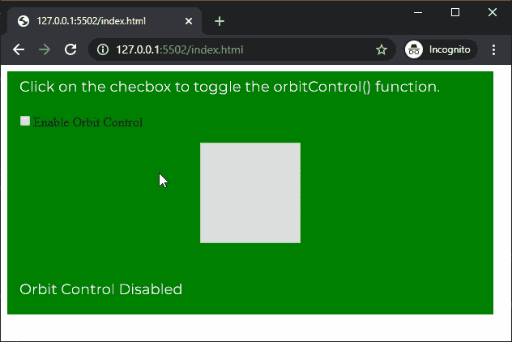

# p5.js | orbitControl()功能

> 原文:[https://www.geeksforgeeks.org/p5-js-orbitcontrol-function/](https://www.geeksforgeeks.org/p5-js-orbitcontrol-function/)

p5.js 中的 **orbitControl()功能**用于使用鼠标或触控板在 3D 草图周围移动。鼠标左键可用于围绕场景中心旋转相机位置。鼠标右键可用于平移相机，无需任何旋转。鼠标滚轮可用于将摄像机移近或移远场景中心。

该函数可以被赋予可选参数，用于控制沿轴移动的灵敏度。所有轴的默认灵敏度为 1。灵敏度的负值可用于反转运动方向。

**语法:**

```
orbitControl( [sensitivityX], [sensitivityY], [sensitivityZ] )
```

**参数:**该功能接受三个参数，如上所述，描述如下:

*   **灵敏度 yX:** 是决定鼠标沿 x 轴移动灵敏度的数字。这是一个可选参数。
*   **灵敏度 yY:** 是决定鼠标沿 y 轴移动灵敏度的数字。这是一个可选参数。
*   **灵敏度 yZ:** 是决定鼠标沿 z 轴移动灵敏度的数字。这是一个可选参数。

下面的例子说明了 p5.js 中的 **orbitControl()函数**:

**例 1:**

```
let newFont;
let orbitControlEnable = false;

function preload() {
  newFont = loadFont('fonts/Montserrat.otf');
}

function setup() {
  createCanvas(600, 300, WEBGL);
  textFont(newFont, 18);

  orbitControlCheck = createCheckbox(
       "Enable Orbit Control", false);

  orbitControlCheck.position(20, 60);

  // Toggle default light
  orbitControlCheck.changed(() => {
    orbitControlEnable = !orbitControlEnable;
  });
}

function draw() {
  background("green");
  text("Click on the checbox to toggle the "
     + "orbitControl() function.", -285, -125);
  noStroke();

  // Enable default lights
  lights();

  // If checkbox is enabled
  if (orbitControlEnable) {

    // Enable orbit control
    orbitControl();

    text("Orbit Control Enabled", -285, 125);
  }
  else {
    text("Orbit Control Disabled", -285, 125);
  }
  box(100);
}
```

**输出:**


**例 2:**

```
let newFont;
let orbitControlEnable = false;

function preload() {
  newFont = loadFont('fonts/Montserrat.otf');
}

function setup() {
  createCanvas(600, 300, WEBGL);
  textFont(newFont, 18);

  xSensitivitySlider = createSlider(0, 5, 1, 0.1);
  xSensitivitySlider.position(20, 50);

  ySensitivitySlider = createSlider(0, 5, 1, 0.1);
  ySensitivitySlider.position(20, 80);

  zSensitivitySlider = createSlider(0, 5, 1, 0.1);
  zSensitivitySlider.position(20, 110);
}

function draw() {
  background("green");
  text("Move the sliders to modify the x, y and"
         + " z orbit sensitivity", -285, -125);
  noStroke();

  xSensitivity = xSensitivitySlider.value();
  ySensitivity = ySensitivitySlider.value();
  zSensitivity = zSensitivitySlider.value();

  text("x Sensitivity is: " + xSensitivity, -285, 100);
  text("y Sensitivity is: " + ySensitivity, -285, 120);
  text("z Sensitivity is: " + zSensitivity, -285, 140);

  // Enable default lights
  lights();

  orbitControl(xSensitivity, ySensitivity, zSensitivity);

  box(100);
}
```

**输出:**


**在线编辑:**[https://editor.p5js.org/](https://editor.p5js.org/)

**环境设置:**

**参考:**T2】https://p5js.org/reference/#/p5/orbitControl