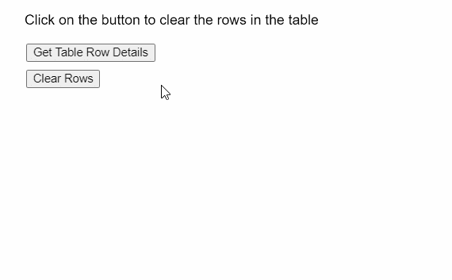

# p5.js | p5。表 clearRows()方法

> 原文:[https://www . geesforgeks . org/P5-js-P5-table-clear rows-method/](https://www.geeksforgeeks.org/p5-js-p5-table-clearrows-method/)

p5 的 **clearRows()方法**。p5.js 中的 Table 用于清除表中的所有行。它不影响列及其标题。它可用于清除表，而不影响其列结构。它没有参数。
**语法:**

```
clearRows()

```

**参数:**此功能无参数。
以下示例说明了 p5.js 中的 **clearRows()函数【T4:
**示例:**** 

## java 描述语言

```
function setup() {
  createCanvas(500, 300);
  textSize(16);

  getColBtn = createButton("Get Table Row Details");
  getColBtn.position(30, 50);
  getColBtn.mouseClicked(getTableRows);

  getColBtn = createButton("Clear Rows");
  getColBtn.position(30, 80);
  getColBtn.mouseClicked(clearAllRows);

  text("Click on the button to clear the"+
       " rows in the table", 20, 20);

  // Create the table
  table = new p5.Table();

  // Add columns
  table.addColumn("author");
  table.addColumn("book");

  // Add two rows
  let newRow = table.addRow();
  newRow.setString("author", "Marcel Proust");
  newRow.setString("book", "In Search of Lost Time");

  newRow = table.addRow();
  newRow.setString("author", "James Joyce");
  newRow.setString("book", "Ulysses");
}

function clearAllRows() {
  clear();
  text("Click on the button to clear"+
       " the rows in the table", 20, 20);

  // Use the clearRow() method to
  // clear all rows in the table
  table.clearRows();

  text("All rows cleared!", 20, 140);
}

function getTableRows() {
  clear();
  text("Click on the button to clear the rows "+
       "in the table", 20, 20);

  // Display all the rows present in the table
  text("There are " + table.getRowCount() + 
       " rows in the table", 20, 140);
  for (let i = 0; i < table.getRowCount(); i++) {
    let rowContents = table.rows[i].arr.toString();
    text("Row " + i + ": " + rowContents, 20, 160 + i * 20);
  }
}
```

**输出:**



**在线编辑:**[【https://editor.p5js.org/】](https://editor.p5js.org/)
**环境设置:**[https://www . geeksforgeeks . org/P5-js-soundfile-object-installation-and-methods/](https://www.geeksforgeeks.org/p5-js-soundfile-object-installation-and-methods/)
**参考:**[https://p5js.org/reference/#/p5.Table/clearRows](https://p5js.org/reference/#/p5.Table/clearRows)