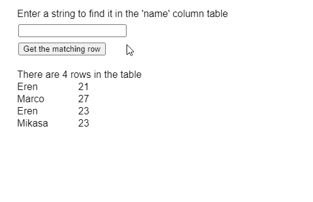
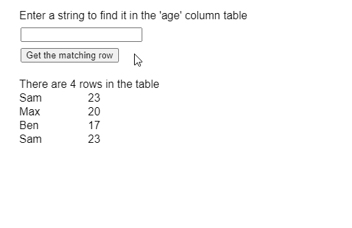

# p5.js p5。表查找行()方法

> 原文:[https://www . geesforgeks . org/P5-js-P5-table-find row-method/](https://www.geeksforgeeks.org/p5-js-p5-table-findrow-method/)

p5 的 **findRow()方法**。p5.js 中的表用于查找包含给定 and 值的第一行，并向该行返回一个值。方法用来搜索行的列可以指定为参数。即使存在多个匹配项，该方法也只返回可能匹配项的第一行。

**语法:**

```
findRow( value, column )
```

**参数:**该函数接受两个参数，如上所述，如下所述:

*   **值:**是指定必须匹配的值的字符串。
*   **列:**是表示要搜索的列的列名或列标识的字符串或数字。

下面的例子说明了 p5.js 中的 **findRow()方法**:

**例 1:**

```
function setup() {
  createCanvas(500, 300);
  textSize(16);

  findQueryInput = createInput();
  findQueryInput.position(30, 40);

  getColBtn =
    createButton("Get the matching row");
  getColBtn.position(30, 70);
  getColBtn.mouseClicked(getFindResults);

  // Create the table
  table = new p5.Table();

  // Add two columns
  table.addColumn("name");
  table.addColumn("age");

  // Add some rows to the table
  let newRow = table.addRow();
  newRow.setString("name", "Eren");
  newRow.setString("age", 21);

  newRow = table.addRow();
  newRow.setString("name", "Marco");
  newRow.setString("age", 27);

  newRow = table.addRow();
  newRow.setString("name", "Eren");
  newRow.setString("age", 23);

  newRow = table.addRow();
  newRow.setString("name", "Mikasa");
  newRow.setString("age", 23);

  showTable();
}

function getFindResults() {
  clear();

  let findQuery = 
      findQueryInput.value();

  // Get the row values
  // using findRow()
  if (findQuery != "") {

    // Find the result in
    // the column of 'name' 
    findResults =
      table.findRow(findQuery, 'name');

    if (findResults) {
      text("The row that matches the query is",
           20, 120);

      // Display the matched value
      text(findResults.arr[0], 20, 140);
      text(findResults.arr[1], 120, 140);
    }
    else text("No Results Found",
              20, 120);

  } else {
    text("The query string is empty",
         20, 120);
  }
  text("Enter a string to find it in " +
       "the 'name' column table",
       20, 20);
}

function showTable() {
  clear();

  // Display the total rows
  // present in the table
  text("There are " + 
       table.getRowCount() + 
       " rows in the table", 20, 120);

  for (let r = 0; r < table.getRowCount(); r++)
    for (let c = 0; c < table.getColumnCount(); c++)
      text(table.getString(r, c),
           20 + c * 100,
           140 + r * 20);

     text("Enter a string to find it in " +
       "the 'name' column table",
       20, 20);
}
```

**输出:**


**例 2:**

```
function setup() {
  createCanvas(500, 300);
  textSize(16);

  findQueryInput = createInput();
  findQueryInput.position(30, 40);

  getColBtn =
    createButton("Get the matching row");
  getColBtn.position(30, 70);
  getColBtn.mouseClicked(getFindResults);

  // Create the table
  table = new p5.Table();

  // Add two columns
  table.addColumn("name");
  table.addColumn("age");

  // Add some rows to the table
  let newRow = table.addRow();
  newRow.setString("name", "Sam");
  newRow.setString("age", 23);

  newRow = table.addRow();
  newRow.setString("name", "Max");
  newRow.setString("age", 20);

  newRow = table.addRow();
  newRow.setString("name", "Ben");
  newRow.setString("age", 17);

  newRow = table.addRow();
  newRow.setString("name", "Sam");
  newRow.setString("age", 23);

  showTable();
}

function getFindResults() {
  clear();

  let findQuery = findQueryInput.value();

  // Get the row values
  // using findRow()
  if (findQuery != "") {

    // Find the result in the
    // column with ID of '1'
    findResults
      = table.findRow(findQuery, 1);

    if (findResults) {
      text("The row that matches the query is",
           20, 120);

      // Display the matched value
      text(findResults.arr[0], 20, 140);
      text(findResults.arr[1], 120, 140);
    }
    else text("No Results Found", 20, 120);

  } else {
    text("The query string is empty", 20, 120);
  }

    text("Enter a string to find it " +
         "in the 'age' column table",
         20, 20);
}

function showTable() {
  clear();

  // Display the total rows present in the table
  text("There are " + 
       table.getRowCount() +
       " rows in the table", 20, 120);

  for (let r = 0; r < table.getRowCount(); r++)
    for (let c = 0; c < table.getColumnCount(); c++)
      text(table.getString(r, c),
           20 + c * 100,
           140 + r * 20);

      text("Enter a string to find it " + 
           "in the 'age' column table",
           20, 20);
}
```

**输出:**


**在线编辑:**[https://editor.p5js.org/](https://editor.p5js.org/)

**环境设置:**

**参考:**T2】https://p5js.org/reference/#/p5.Table/findRow