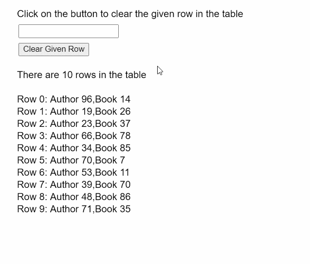
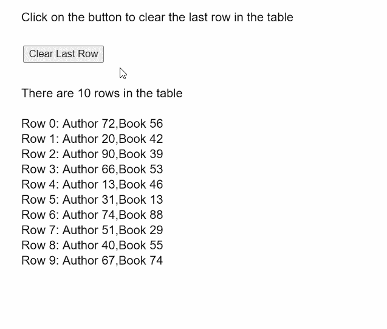

# p5.js | p5。表格删除行()方法

> 原文:[https://www . geesforgeks . org/P5-js-P5-table-remove row-method/](https://www.geeksforgeeks.org/p5-js-p5-table-removerow-method/)

p5 的 **removeRow()方法**。p5.js 中的 Table 用于从表中移除给定的行。要删除的行是使用其行标识指定的。

**语法:**

```
removeRow( id )
```

**参数:**该函数接受如上所述的单个参数，如下所述:

*   **id:** 是表示要删除的行的 id 的数字。

下面的例子说明了 p5.js 中的 **removeRow()函数**:

**例 1:**

```
function setup() {
  createCanvas(500, 400);
  textSize(16);

  rowInput = createInput();
  rowInput.position(30, 40);

  clearRowBtn = createButton("Clear Given Row");
  clearRowBtn.position(30, 70);
  clearRowBtn.mouseClicked(clearRow);

  // Create the table
  table = new p5.Table();

  // Add columns
  table.addColumn("author");
  table.addColumn("book");

  // Add 10 random rows to the table
  for (let i = 0; i < 10; i++) {
    let newRow = table.addRow();
    newRow.setString("author", "Author " + floor(random(1, 100)));
    newRow.setString("book", "Book " + floor(random(1, 100)));
  }

  // Display the rows currently present
  getTableRows();
}

function clearRow() {
  clear();
  text("Click on the button to clear the given row in the table", 20, 20);

  // Get the index of the row to be removed
  let rowToClear = int(rowInput.value());

  // Use the removeRow() method to
  // clear the given row of the table
  if (rowToClear >= 0 && rowToClear < table.getRowCount())
    table.removeRow(rowToClear);

  text("Last row cleared!", 20, 140);
  getTableRows();
}

function getTableRows() {
  clear();
  text("Click on the button to clear the given row in the table", 20, 20);

  // Display all the rows present in the table
  text("There are " + table.getRowCount() + " rows in the table", 20, 120);
  for (let i = 0; i < table.getRowCount(); i++) {
    let rowContents = table.rows[i].arr.toString();
    text("Row " + i + ": " + rowContents, 20, 160 + i * 20);
  }
}
```

**输出:**



**例 2:**

```
function setup() {
  createCanvas(500, 400);
  textSize(16);

  removeRowBtn = createButton("Clear Last Row");
  removeRowBtn.position(30, 60);
  removeRowBtn.mouseClicked(clearLastRow);

  // Create the table
  table = new p5.Table();

  // Add columns
  table.addColumn("author");
  table.addColumn("book");

  // Add 10 random rows to the table
  for (let i = 0; i < 10; i++) {
    let newRow = table.addRow();
    newRow.setString("author", "Author " + floor(random(1, 100)));
    newRow.setString("book", "Book " + floor(random(1, 100)));
  }

  // Display the rows currently present
  getTableRows();
}

function clearLastRow() {
  clear();
  text("Click on the button to clear the last row in the table", 20, 20);

  // Get the index of the last row
  // of the table
  let lastRow = table.getRowCount() - 1;

  // Use the removeRow() method to
  // clear the given row of the table
  if (lastRow >= 0) table.removeRow(lastRow);

  text("Last row cleared!", 20, 140);
  getTableRows();
}

function getTableRows() {
  clear();
  text("Click on the button to clear the last row in the table", 20, 20);

  // Display all the rows present in the table
  text("There are " + table.getRowCount() + " rows in the table", 20, 120);
  for (let i = 0; i < table.getRowCount(); i++) {
    let rowContents = table.rows[i].arr.toString();
    text("Row " + i + ": " + rowContents, 20, 160 + i * 20);
  }
}
```

**输出:**



**在线编辑:**[https://editor.p5js.org/](https://editor.p5js.org/)

**环境设置:**

**参考:**T2】https://p5js.org/reference/#/p5.Table/removeRow