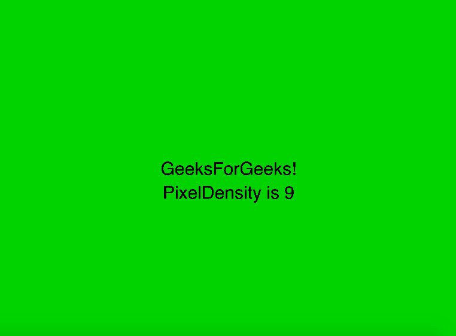
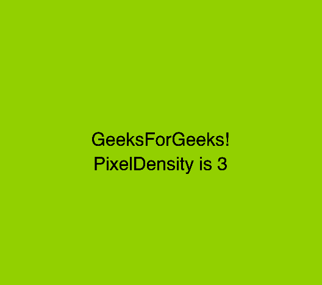

# p5.js | pixelDensity()功能

> 原文:[https://www.geeksforgeeks.org/p5-js-pixeldensity-function/](https://www.geeksforgeeks.org/p5-js-pixeldensity-function/)

p5.js 中的 **pixelDensity()功能**用于设置高像素密度显示器的像素缩放。像素密度的默认值设置为匹配显示密度。像素密度(1)用于关闭显示密度。不带参数的 pixelDensity()函数返回草图的当前像素密度。

**语法:**

```
pixelDensity(c)
```

**参数:**该功能接受单个参数 **c** ，存储刻度值。

下面的程序说明了 p5.js 中的 pixelDensity()函数:

**示例 1:** 本示例使用 pixelDensity()函数显示像素密度。

```
function setup() {

    // Create canvas of window size
    createCanvas(windowWidth, windowHeight);

    // Set Pixel Density to 9
    pixelDensity(9);
}

function draw() {

    // Set the background color
    background(0, 200, 0);

    color("green");

    // Set the text size
    textSize(30);

    // Set the text align
    textAlign(CENTER);

    // Display text on the screen
    text("GeeksForGeeks!", windowWidth/2,
                windowHeight/2);
    text("PixelDensity is " + pixelDensity(),
         windowWidth/2, windowHeight/2 + 40);

}
```

**输出:**


**示例 2:** 本示例使用 pixelDensity()函数显示像素密度。

```
function setup() {

    // Create canvas of window size
    createCanvas(windowWidth, windowHeight);

    // Set Pixel Density to 9
    pixelDensity(3);
}

function draw() {

    // Set the background color
    background(160, 200, 50);

    // Set the text size
    textSize(30);

    // Set the text align
    textAlign(CENTER);

    // Display text on the screen
    text("GeeksForGeeks!", windowWidth/2,
                windowHeight/2);
    text("PixelDensity is " + pixelDensity(),
         windowWidth/2, windowHeight/2 + 40);

}
```

**输出:**


**参考:**T2】https://p5js.org/reference/#/p5/pixelDensity