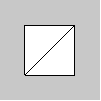

# p5.js | plane()功能

> 原文:[https://www.geeksforgeeks.org/p5-js-plane-function/](https://www.geeksforgeeks.org/p5-js-plane-function/)

p5.js 中的 plane()函数用于根据给定的高度和宽度绘制平面。

**语法:**

```
plane( width, height, detailX, detailY )
```

**参数:**该函数接受上面提到的和下面描述的四个参数:

*   **宽度:**此参数保存要绘制的平面的宽度。
*   **高度:**此参数保存要绘制的平面的高度。
*   **detailX:** 是一个可选参数，取 x 维的三角形细分数。
*   **detailY:** 是一个可选参数，取 y 维的三角形细分个数。

下面的程序说明了 p5.js 中的 plane()函数:

**示例:**

```
function setup() {

    // Create canvas size
    createCanvas(100, 100, WEBGL);
}

// Function to draw plane
function draw() {
    background(200);

    // Plane with width 50 
    // and height 50
    plane(50, 50);
}                    
```

**输出:**


**参考:**T2】https://p5js.org/reference/#/p5/plane