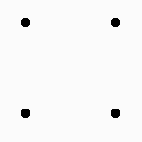
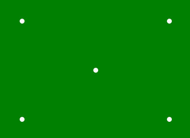

# p5.js |点()功能

> 原文:[https://www.geeksforgeeks.org/p5-js-point-function/](https://www.geeksforgeeks.org/p5-js-point-function/)

**点()函数**是 p5.js 中的一个内置函数，用于绘制给定坐标位置的点。

**语法:**

```
point( x, y, [z])
```

**参数:**该函数接受三个参数，如下所述

*   **x:** 用于设置点的 x 坐标。
*   **y:** 用于设置点的 y 坐标。
*   **z:** 用于在 WebGL 模式下设置 z 坐标。

**例 1:**

```
function setup() {

    // Create Canvas of given size 
    createCanvas(400, 300);

}

function draw() {

    // Use point() function to draw point
    point(50, 50);
    point(150, 50);
    point(50, 150);
    point(150, 150);

    // Use strokeWeight() function to set
    // the weight of point
    strokeWeight(10);
}
```

**输出:**


**例 2:**

```
function setup() { 

    // Create Canvas of given size 
    createCanvas(400, 300); 
} 

function draw() { 

    // Set the background color
    background('green');

    // Set the stroke weight
    strokeWeight(10);

    // Set stroke color
    stroke('white');

    // Draw point
    point(50, 50);

    point(50, 250);

    point(350, 50);

    point(350, 250);

    point(200, 150);

} 
```

**输出:**


**在线编辑:**[【https://editor.p5js.org/】](https://editor.p5js.org/)
**环境设置:**[https://www . geeksforgeeks . org/P5-js-soundfile-object-installation-and-methods/](https://www.geeksforgeeks.org/p5-js-soundfile-object-installation-and-methods/)

**参考:**T2】https://p5js.org/reference/#/p5/point