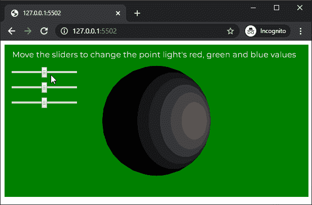
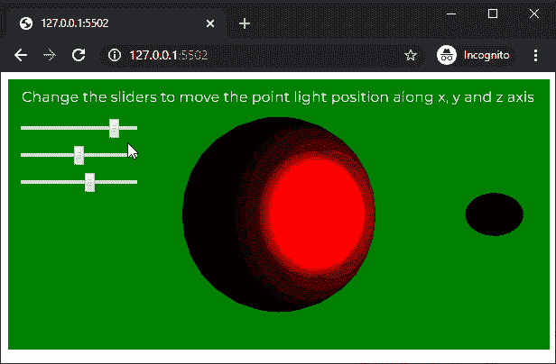

# p5.js | pointLight()功能

> 原文:[https://www.geeksforgeeks.org/p5-js-pointlight-function/](https://www.geeksforgeeks.org/p5-js-pointlight-function/)

p5.js 中的 **pointLight()功能**用于创建场景中指定颜色和位置的点光源。一个场景一次最多可以有 5 个活动点光源。

**语法:**

```
pointLight( v1, v2, v3, x, y, z )
```

运筹学

```
pointLight( v1, v2, v3, position )
```

运筹学

```
pointLight( color, x, y, z )
```

运筹学

```
pointLight( color, position )
```

**参数:**该函数接受八个参数，如上所述，如下所述:

*   **v1:** 是决定相对于当前颜色范围的红色或色相值的数字。
*   **v2:** 是决定相对于当前颜色范围的绿色或饱和度值的数字。
*   **v3:** 是决定相对于当前颜色范围的蓝色或亮度值的数字。
*   **x:** 是决定光线 x 轴位置的数字。
*   **y:** 是决定光线 y 轴位置的数字。
*   **z:** 是决定光线 z 轴位置的数字。
*   **位置:**是 p5。定义光线位置的向量。
*   **颜色:**是颜色串或 p5。定义点光源颜色的颜色。

下面的例子说明了 p5.js 中的 **pointLight()函数**:

**例 1:**

```
let newFont;
let directionalLightEnable = false;

function preload() {
  newFont = loadFont('fonts/Montserrat.otf');
}

function setup() {
  createCanvas(600, 300, WEBGL);
  textFont(newFont, 16);

  redSlider = createSlider(0, 255, 128, 1);
  redSlider.position(20, 50);

  greenSlider = createSlider(0, 255, 128, 1);
  greenSlider.position(20, 80);

  blueSlider = createSlider(0, 255, 128, 1);
  blueSlider.position(20, 110);
}

function draw() {
  background('green');
  text("Move the sliders to change the point light's red, "+
                        "green and blue values", -285, -125);
  noStroke();

  redValue = redSlider.value();
  greenValue = greenSlider.value();
  blueValue = blueSlider.value();

  // Create a point light with the selected light color
  pointLight(redValue, greenValue, blueValue, 100, 0, 150);

  ambientMaterial(255);

  // Create the sphere on which the point light will work
  sphere(100);
}
```

**输出:**


**例 2:**

```
let newFont;
let directionalLightEnable = false;

function preload() {
  newFont = loadFont('fonts/Montserrat.otf');
}

function setup() {
  createCanvas(600, 300, WEBGL);
  textFont(newFont, 16);

  xPosSlider = createSlider(-150, 150, 100, 1);
  xPosSlider.position(20, 50);

  yPosSlider = createSlider(-300, 300, 0, 1);
  yPosSlider.position(20, 80);

  zPosSlider = createSlider(0, 250, 150, 1);
  zPosSlider.position(20, 110);

}

function draw() {
  background('green');
  text("Change the sliders to move the point light position "+
                          "along x, y and z axis", -285, -125);
  noStroke();

  xPositionValue = xPosSlider.value();
  yPositionValue = yPosSlider.value();
  zPositionValue = zPosSlider.value();

  // Create a point light at the selected location
  pointLight(255, 0, 0, xPositionValue, yPositionValue, zPositionValue);

  // Create a sphere to show the demonstrate
  // of the point light location
  translate(xPositionValue, yPositionValue, zPositionValue);
  sphere(10);
  translate(-xPositionValue, -yPositionValue, -zPositionValue);

  specularMaterial(255);

  // Create the sphere on which the point light will work
  sphere(100);
}
```

**输出:**


**在线编辑:**[https://editor.p5js.org/](https://editor.p5js.org/)

**环境设置:**

**参考:**T2】https://p5js.org/reference/#/p5/pointLight