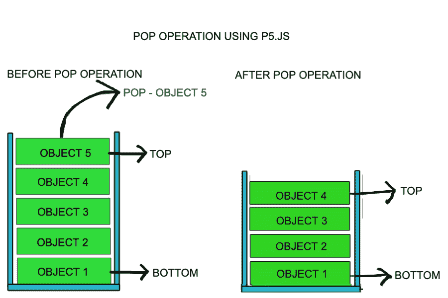
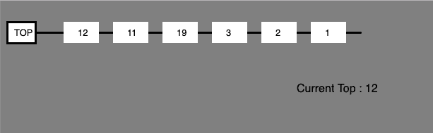
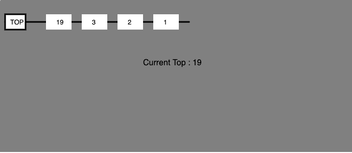

# p5.js |堆栈中的弹出操作

> 原文:[https://www.geeksforgeeks.org/p5-js-pop-operation-in-stack/](https://www.geeksforgeeks.org/p5-js-pop-operation-in-stack/)

堆栈是一种线性数据结构，它遵循执行操作的特定顺序。顺序可以是后进先出或后进先出。


**栈上弹出操作:**从栈顶移除内容的同时访问内容，称为**弹出**操作。在 pop()操作的数组实现中，数据元素实际上并没有被移除，而是 top 被递减到堆栈中的较低位置，以指向下一个值。但是在链表实现中，pop()实际上移除了数据元素并释放了内存空间。



**方法:**pop()操作可能包括以下步骤:

*   检查堆栈是否为空。
*   如果堆栈为空，将产生错误并退出。
*   如果堆栈不为空，则访问顶部指向的数据元素。
*   使用 array.pop()操作删除缓冲区中的元素。
*   回报成功。

**示例 1:** 本示例仅描述堆栈上的推送操作。

```
<!DOCTYPE html>
<html>

<head>
    <title>Stack Data Structure</title>

    <meta charset="UTF-8">

    <script src=
"https://cdnjs.cloudflare.com/ajax/libs/p5.js/0.8.0/p5.min.js" 
    type="text/javascript"></script>

    <style>
        body {
            padding: 0;
            margin: 0;
        } 
        canvas {
            vertical-align: top;
        } 
    </style>
</head>

<body>
    <script>

        // Define Stack function 
        function Stack(array) {
            this.array = [];
            if (array) this.array = array;
        }

        // Add Get Buffer property to object
        // constructor which slices the array
        Stack.prototype.getBuffer = function() {
            return this.array.slice();
        }

        // Add isEmpty properties to object
        // constructor which returns the
        // length of the array
        Stack.prototype.isEmpty = function() {
            return this.array.length == 0;
        }

        // Instance of the stack class
        var stack1 = new Stack(); //Stack { array: [] }

        // Add Push property to object constructor
        // which push elements to the array
        Stack.prototype.push = function(value) {
            this.array.push(value);
        }

        function setup() {

            // Create Canvas of size display width * 300
            createCanvas(displayWidth, 300);
        }

        function draw() {

            // Set background color
            background("grey");

            // Set stroke weight
            strokeWeight(3);

            // Set stroke color
            stroke('black');
            line(10, 45, 90, 45);
            rect(10, 30, 40, 30);
            noStroke();
            text("TOP", 20, 50);

            // Display stack 
            for(var i = stack1['array'].length-1; i >= 0; i--) {
                var p = 10;
                translate(70, 0);
                strokeWeight(3);
                stroke('black');
                line(10+p, 45, p+80, 45);
                noStroke();
                rect(10+p, 30, 40+p, 30);
                text(stack1['array'][i], 40, 50);
                p += 10;
            }

            textSize(16);
            text("Current Top : " + stack1.peek(), 0, 130); 
            textSize(13);
        }

        // Peek Function
        Stack.prototype.peek = function() {
            return this.array[this.array.length-1];
        }

        // Call to push operation
        stack1.push(1);
        stack1.push(2);
        stack1.push(3);
        stack1.push(19);
        stack1.push(11);
        stack1.push(12);
    </script>
</body>

</html>                         
```

**输出:**


**示例 2:** 本示例通过调用 *stack1.pop()* 函数，在堆栈中推送元素后，使用两次 Pop 操作。

```
<!DOCTYPE html>
<html>

<head>
    <title>Stack Data Structure</title>

    <meta charset="UTF-8">

    <script src=
"https://cdnjs.cloudflare.com/ajax/libs/p5.js/0.8.0/p5.min.js" 
    type="text/javascript"></script>

    <style>
        body {
            padding: 0;
            margin: 0;
        } 
        canvas {
            vertical-align: top;
        } 
    </style>
</head>

<body>
    <script>

        // Define Stack function 
        function Stack(array) {
            this.array = [];
            if (array) this.array = array;
        }

        // Add Get Buffer property to object
        // constructor which slices the array
        Stack.prototype.getBuffer = function() {
            return this.array.slice();
        }

        // Add isEmpty properties to object
        // constructor which returns the
        // length of the array
        Stack.prototype.isEmpty = function() {
            return this.array.length == 0;
        }

        // Instance of the stack class
        var stack1 = new Stack(); //Stack { array: [] }

        // Add Push property to object constructor
        // which push elements to the array
        Stack.prototype.push = function(value) {
            this.array.push(value);
        }

        function setup() {

            // Create Canvas of size display width * 300
            createCanvas(displayWidth, 300);
        }

        function draw() {

            // Set background color
            background("grey");

            // Set stroke weight
            strokeWeight(3);

            // Set stroke color
            stroke('black');
            line(10, 45, 90, 45);
            rect(10, 30, 40, 30);
            noStroke();
            text("TOP", 20, 50);

            // Display stack 
            for(var i = stack1['array'].length-1; i >= 0; i--) {
                var p = 10;
                translate(70, 0);
                strokeWeight(3);
                stroke('black');
                line(10+p, 45, p+80, 45);
                noStroke();
                rect(10+p, 30, 40+p, 30);
                text(stack1['array'][i], 40, 50);
                p += 10;
            }

            textSize(16);
            text("Current Top : " + stack1.peek(), 0, 130); 
            textSize(13);
        }

        // Peek Function
        Stack.prototype.peek = function() {
            return this.array[this.array.length-1];
        }

        // Pop operation
        Stack.prototype.pop = function() {
            return this.array.pop();
        }

        // Call to push operation
        stack1.push(1);
        stack1.push(2);
        stack1.push(3);
        stack1.push(19);
        stack1.push(11);
        stack1.push(12);

        // Call to pop operation
        stack1.pop();
        stack1.pop();
    </script>
</body>

</html>                        
```

**输出:**
