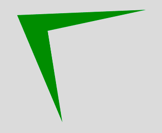
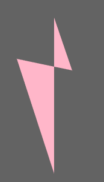

# p5.js | quad()功能

> 原文:[https://www.geeksforgeeks.org/p5-js-quad-function/](https://www.geeksforgeeks.org/p5-js-quad-function/)

**四边形()函数**是 p5.js 中的一个内置函数，用于绘制四边形。四边形是四边多边形。它的功能是创建一个类似于矩形的形状，但是两条边之间的角度并不局限于 90 度。

**语法:**

```
quad(x1, y1, x2, y2, x3, y3, x4, y4)
```

或者

```
quad(x1, y1, z1, x2, y2, z2, x3, y3, z3, x4, y4, z4)
```

**参数:**该功能接受上述及下述十二个参数:

*   **x1:** 该参数取第一点的 x 坐标。
*   **y1:** 该参数取第一点的 y 坐标。
*   **z1:** 该参数取第一点的 z 坐标。
*   **x2:** 该参数取第二点的 x 坐标。
*   **y2:** 该参数取第二点的 y 坐标。
*   **z2:** 该参数取第二点的 z 坐标。
*   **x3:** 该参数取第三点的 x 坐标。
*   **y3:** 此参数取第三点的 y 坐标。
*   **z3:** 该参数取第三点的 z 坐标。
*   **x4:** 该参数取第四点的 z 坐标。
*   **y4:** 此参数取第四点的 z 坐标。
*   **z4:** 该参数取第四点的 z 坐标。

下面的程序说明了 P5.js 中的 quad()函数:

**示例 1:** 本示例使用 quad()函数创建多边形，而不使用 z 坐标。

```
function setup() {

    // Create canvas of given size
    createCanvas(400, 400);
}

function draw() {

    // Set the background color
    background(220);

    noStroke();

    // Set the fill color
    fill('green');

    // x1, y1 = 38, 31; x2, y2 = 300, 20;
    // x3, y3 = 100, 63; x4, y4 = 130, 250
    quad(38, 31, 300, 20, 100, 63, 130, 250); 
}
```

**输出:**


**示例 2:** 本示例使用 quad()函数创建 z 坐标的多边形。

```
function setup() {

    // Create canvas of given size
    createCanvas(400, 400);
}

function draw() {

    // Set the background color
    background(99);

    noStroke();

    // Set the filled color
    fill('pink');

    // x1, y1, z1 = 38, 131, 100;
    // x2, y2, z2 = 320, 100, 63; 
    // x3, y3, z3 = 130, 150, 134; 
    // x4, y4, z4 = 155, 66, 88;
    quad(38, 131, 100, 320, 100, 63,
        130, 150, 134, 155, 66, 88); 
}
```

**输出:**


**参考:**T2】https://p5js.org/reference/#/p5/quad