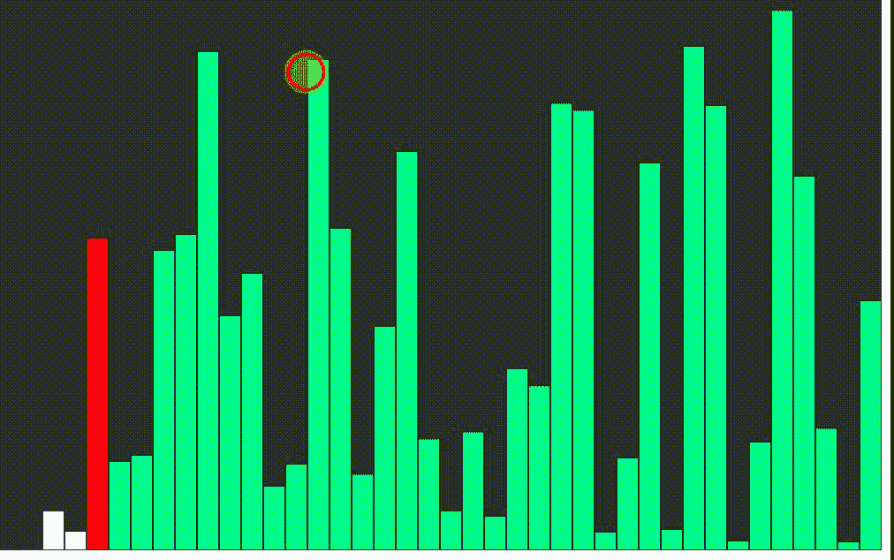

# p5.js |快速排序

> 原文:[https://www.geeksforgeeks.org/p5-js-quick-sort/](https://www.geeksforgeeks.org/p5-js-quick-sort/)

快速排序是一种分治算法。它选取一个元素作为透视，并围绕选取的透视对给定数组进行分区。快速排序有许多不同的版本，它们以不同的方式选取轴心。

*   始终选择第一个元素作为轴心。
*   总是选择最后一个元素作为轴心。
*   选择一个随机元素作为轴心。
*   选择中线作为枢轴。

**进场:**

*   首先取一个随机值的数组。
*   根据数组索引处的值并排绘制矩形。
*   在 p5.js 中实现快速排序算法
*   分配时间延迟，以便可视化每个连续阶段的变化。

**示例:**

```
<!DOCTYPE html>
<html>

<head>
    <meta charset="UTF-8">

    <title>QuickSort Sorting Algorithm</title>

    <script src=
"https://cdnjs.cloudflare.com/ajax/libs/p5.js/0.8.0/p5.js"
    type="text/javascript"></script>

    <style> 
        body {
            padding: 0;
            margin: 0;
        } 
        canvas {
            vertical-align: top;
        } 
    </style>
</head>

<body>
    <script type="text/javascript">

        // Assign Global Values
        let values = [];
        let w = 20;
        let states = [];
        function setup() {

            // Create Canvas of given Size
            createCanvas(800, 500);

            // Assign Array of Random Values
            values = new Array(floor(width/w));

            for(let i = 0; i < values.length; i++) {
                values[i] = float(random(height));
                states[i] = -1; 
            }

            // To print values to Browser's Console
            print("Unsorted Array:" + values);

            // Invoke QuickSort Function
            quickSort(values, 0, values.length);

            print("Sorted Array:" + values);
        }

        // Asynchronous Definition of Quick Sort Function
        async function quickSort(arr, start, end) {
            if(start >= end) {
                return;
            }
            let index = await partition(arr, start, end);
            states[index] = -1;

            // Promise.all is used so that each function
            // should invoke simultaneously
            await Promise.all([quickSort(arr, start, index-1),
                    quickSort(arr, index+1, end)]);
        }

        // Asynchronous Definition of Partition Function
        async function partition(arr, start, end) {

            for(let i = start; i< end; i++) {
                states[i] = 1;
            }

            let pivotIndex = start;
            let pivotValue = arr[end];
            states[pivotIndex] = 0;

            for(let i = start; i < end; i++) {
                if(arr[i]<pivotValue) {
                    await swap(arr, i, pivotIndex);
                    states[pivotIndex] = -1;
                    pivotIndex++;
                    states[pivotIndex] = 0;
                }
            }

            await swap(arr, pivotIndex, end);

                for(let i = start; i < end; i++) {
                    states[i] = -1;
                }

            return pivotIndex;
        }

        // Definition of Draw function
        function draw() {

            // Set Background Color 
            background(51);

            for(let i = 0; i < values.length; i++) {
                stroke(0);
                fill(255);

                if(states[i] == 0) {

                    // Pivot Element
                    fill(255, 0, 0);
                }
                else if (states[i]==1) {
                    // Sorting bar
                    fill("#58FA82");
                }
                else {
                    // Sorted Bars
                    fill(255);
                }

                rect(i*w, height - values[i], w, values[i]);
            }
        }

        async function swap(arr, a, b) {

            // Call to sleep function
            await sleep(100);
            let t = arr[a];
            arr[a] = arr[b];
            arr[b] = t;
        }

        // Definition of sleep function
        function sleep(ms) {
            return new Promise(resolve
                    => setTimeout(resolve, ms));
        }
    </script>
</body>

</html>                    
```

**输出:**
