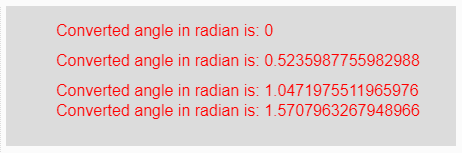
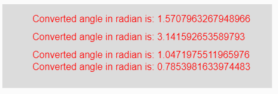

# p5.js |弧度()函数

> 原文:[https://www.geeksforgeeks.org/p5-js-radians-function/](https://www.geeksforgeeks.org/p5-js-radians-function/)

p5.js 中的**弧度()函数**用于将给定的度数测量值转换为其对应的弧度值。

**语法:**

```
radians( degrees )
```

**参数:**本功能接受单参数**度**，转换为弧度。

**返回值:**返回角度的转换弧度值。

下面的程序说明了 p5.js 中的弧度()函数:

**示例 1:** 本示例使用弧度()函数将给定度数转换为其对应的弧度。

```
function setup() { 

    // Creating Canvas size
    createCanvas(450, 140); 
} 

function draw() { 

    // Set the background color 
    background(220); 

    // Initializing some angles in degree
    let Deg1 = 0; 
    let Deg2 = 30; 
    let Deg3 = 60; 
    let Deg4 = 90; 

    // Calling to radians() function.
    let A = radians(Deg1);
    let B = radians(Deg2);
    let C = radians(Deg3);
    let D = radians(Deg4);

    // Set the size of text 
    textSize(16); 

    // Set the text color 
    fill(color('red')); 

    // Getting converted angles into radians
    text("Converted angle in radian is: " + A, 50, 30);
    text("Converted angle in radian is: " + B, 50, 60);
    text("Converted angle in radian is: " + C, 50, 90);
    text("Converted angle in radian is: " + D, 50, 110);
} 
```

**输出:**


**示例 2:** 本示例使用弧度()函数将给定度数转换为其对应的弧度。

```
function setup() { 

    // Creating Canvas size
    createCanvas(450, 140); 
} 

function draw() { 

    // Set the background color 
    background(220); 

    // Calling to radians() function with different
    // degrees value as parameter
    let A = radians(90);
    let B = radians(180);
    let C = radians(60);
    let D = radians(45);

    // Set the size of text 
    textSize(16); 

    // Set the text color 
    fill(color('red')); 

    // Getting converted angles in radians
    text("Converted angle in radian is: " + A, 50, 30);
    text("Converted angle in radian is: " + B, 50, 60);
    text("Converted angle in radian is: " + C, 50, 90);
    text("Converted angle in radian is: " + D, 50, 110);
}  
```

**输出:**


**参考:**T2】https://p5js.org/reference/#/p5/radians