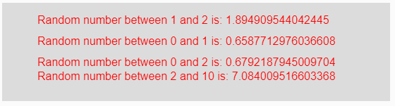
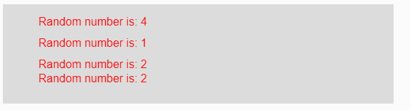

# p5.js | random()函数

> 原文:[https://www.geeksforgeeks.org/p5-js-random-function/](https://www.geeksforgeeks.org/p5-js-random-function/)

p5.js 中的 **random()函数**用于返回作为参数给定的范围之间的随机浮点数。

**语法:**

```
random(Min, Max)
```

或者

```
random(Array)
```

**参数:**该功能接受三个参数，如上所述，描述如下:

*   **Min:** 这是将要创建的随机数的下限。这是一个包含创建的随机数的数字。
*   **Max:** 这是将要创建的随机数的上限。这是一个具有创建的随机数的排它数。
*   **数组:**这是一个由一些元素组成的数组，从这个数组中可以返回任意一个随机数。

**返回值:**返回随机数。

下面的程序说明了 p5.js 中的 random()函数:

**示例 1:** 本示例使用 random()函数返回给定范围之间的随机浮点数。

```
function setup() { 

    // Creating Canvas size
    createCanvas(550, 140); 

    // Set the background color 
    background(220); 

    // Calling to random() function with
    // min and max parameters
    let A = random(1, 2);
    let B = random(0, 1);
    let C = random(2);
    let D = random(2, 10);

    // Set the size of text 
    textSize(16); 

    // Set the text color 
    fill(color('red')); 

    // Getting random number
    text("Random number between 1 and 2 is: " + A, 50, 30);
    text("Random number between 0 and 1 is: " + B, 50, 60);
    text("Random number between 0 and 2 is: " + C, 50, 90);
    text("Random number between 2 and 10 is: " + D, 50, 110);
} 
```

**输出:**


**注意:**在上面的代码中，变量“C”中只传递了一个参数，然后它返回一个从下限 0 到上限的随机数。

**示例 2:** 本示例使用 random()函数返回给定范围之间的随机浮点数。

```
function setup() { 

    // Creating Canvas size
    createCanvas(550, 140); 

    // Set the background color 
    background(220); 

    // Calling to random() function with
    // parameter array of some elements
    let A = random([1, 2, 3, 4]);
    let B = random([0, 1]);
    let C = random([2, 6, 7, 9]);
    let D = random([2, 10]);

    // Set the size of text 
    textSize(16); 

    // Set the text color 
    fill(color('red')); 

    // Getting random number
    text("Random number is: " + A, 50, 30);
    text("Random number is: " + B, 50, 60);
    text("Random number is: " + C, 50, 90);
    text("Random number is: " + D, 50, 110);
} 
```

**输出:**


**参考:**T2】https://p5js.org/reference/#/p5/random