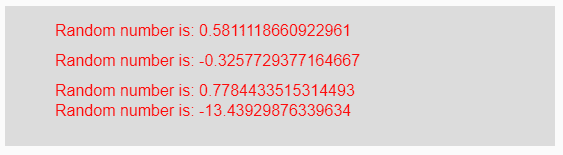
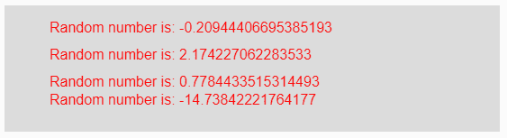

# p5.js | randomGaussian()函数

> 原文:[https://www . geesforgeks . org/P5-js-randomgaussian-function/](https://www.geeksforgeeks.org/p5-js-randomgaussian-function/)

p5.js 中的 **randomGaussian()函数**用于返回拟合高斯或正态分布的随机值，该分布的均值和标准差作为参数给出。

**语法:**

```
randomGaussian( Mean, StandardDeviation )
```

**参数:**该函数接受两个参数，如上所述，如下所述:

*   **均值:**是生成的随机值的均值。
*   **标准差:**是生成的随机值的标准差。

**注:**

*   如果一个参数作为参数传递，这意味着平均值和标准偏差为 1。
*   如果两个参数作为参数传递，这意味着第一个是平均值，第二个是标准偏差。
*   如果没有参数作为参数传递，这意味着平均值为 0，标准偏差为 1。

**返回值:**返回一个随机数。

下面的程序说明了 p5.js 中的 randomGaussain()函数:

**示例 1:** 本示例使用 randomGaussian()函数返回平均值和标准差作为参数的随机值。

```
function setup() { 

    // Creating Canvas size
    createCanvas(550, 140); 

    // Set the background color 
    background(220); 

    // Calling to randomSeed() function
    // It is used for getting constant random
    // values each time the code is run
    randomSeed(9)

    // Calling to randomGaussian() function
    // with mean and sd parameters
    let A = randomGaussian(1, 2);
    let B = randomGaussian(0, 1);
    let C = randomGaussian(2);
    let D = randomGaussian(2, 10);

    // Set the size of text 
    textSize(16); 

    // Set the text color 
    fill(color('red')); 

    // Getting random number
    text("Random number is: " + A, 50, 30);
    text("Random number is: " + B, 50, 60);
    text("Random number is: " + C, 50, 90);
    text("Random number is: " + D, 50, 110);
}
```

**输出:**


**注:**在上例中，变量“C”包含一个参数，即均值为 2，但标准差为 1。

**示例 2:** 本示例使用 randomGaussian()函数返回平均值和标准差作为参数的随机值。

```
function setup() { 

    // Creating Canvas size
    createCanvas(550, 140); 

    // Set the background color 
    background(220); 

    // Calling to randomSeed() function
    // It is used for getting constant random
    // values each time the code is run
    randomSeed(9)

    // Calling to randomGaussian() function with
    // mean and sd parameters
    let A = randomGaussian();
    let B = randomGaussian(2.5);
    let C = randomGaussian(2);
    let D = randomGaussian(20, 22.5);

    // Set the size of text 
    textSize(16); 

    // Set the text color 
    fill(color('red')); 

    // Getting random number
    text("Random number is: " + A, 50, 30);
    text("Random number is: " + B, 50, 60);
    text("Random number is: " + C, 50, 90);
    text("Random number is: " + D, 50, 110);
} 
```

**输出:**


**参考:**T2】https://p5js.org/reference/#/p5/randomGaussian