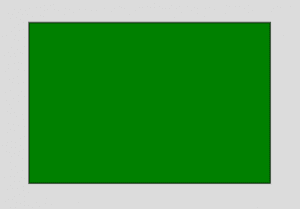
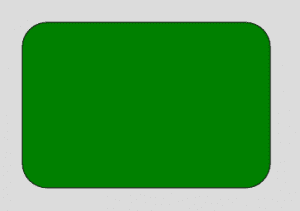
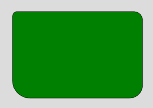

# p5.js | rect()函数

> 原文:[https://www.geeksforgeeks.org/p5-js-rect-function/](https://www.geeksforgeeks.org/p5-js-rect-function/)

**rect()函数**是 p5.js 中的一个内置函数，用于在屏幕上绘制矩形。矩形包含四条边和四个角。矩形的每个角度都是 90 度。矩形两边的长度相等。

**语法:**

```
rect( x, y, w, h, tl, tr, br, bl )
```

或者

```
rect( x, y, w, h, detailX, detailY ) 
```

**参数:**该功能接受许多参数，如上所述，如下所述:

*   **x:** 用于设置矩形的 x 坐标。
*   **y:** 用于设置矩形的 y 坐标。
*   **w:** 用于设置矩形的宽度。
*   **h:** 用于设置矩形的高度。
*   **tl:** 为可选参数，用于设置左上角半径。
*   **tr:** 为可选参数，用于设置右上角半径。
*   **br:** 为可选参数，用于设置右下角半径。
*   **bl:** 为可选参数，用于设置左下角半径。
*   **detailX:** 用于设置 x 方向的线段数。
*   **detailY:** 用于设置 y 方向的线段数。

**例 1:**

## java 描述语言

```
function setup() {

    // Create Canvas of given size
    createCanvas(400, 300);

}

function draw() {

    background(220);

    // Use color() function
    let c = color('green');

    // Use fill() function to fill color
    fill(c);

    // Draw a rectangle
    rect(50, 50, 300, 200);

}
```

**输出:**



**例 2:**

## java 描述语言

```
function setup() {

    // Create Canvas of given size
    createCanvas(400, 300);

}

function draw() {

    background(220);

    // Use color() function
    let c = color('green');

    // Use fill() function to fill color
    fill(c);

    // Draw a rectangle
    rect(50, 50, 300, 200, 30);

}
```

**输出:**



**例 3:**

## java 描述语言

```
function setup() {

    // Create Canvas of given size
    createCanvas(400, 300);

}

function draw() {

    background(220);

    // Use color() function
    let c = color('green');

    // Use fill() function to fill color
    fill(c);

    // Draw a rectangle
    rect(50, 50, 300, 200, 10, 20, 30, 40);

}
```

**输出:**



**在线编辑:**[【https://editor.p5js.org/】](https://editor.p5js.org/)
**环境设置:**[https://www . geeksforgeeks . org/P5-js-soundfile-object-installation-and-methods/](https://www.geeksforgeeks.org/p5-js-soundfile-object-installation-and-methods/)
**参考:**[https://p5js.org/reference/#/p5/rect](https://p5js.org/reference/#/p5/rect)