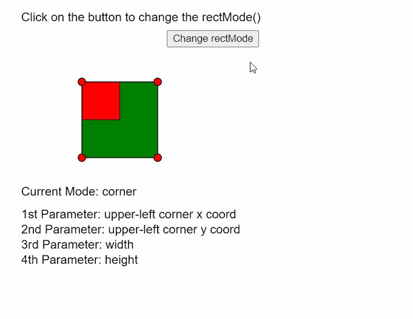

# p5.js | rectMode()函数

> 原文:[https://www.geeksforgeeks.org/p5-js-rectmode-function/](https://www.geeksforgeeks.org/p5-js-rectmode-function/)

p5.js 中的 **rectMode()函数**用于改变对 **rect()** 函数给出的参数的解释方式。这将修改绘制矩形的位置。

该功能可以有四种模式:

*   **CORNER:** 该模式将前两个参数解释为形状的左上角。第三和第四个参数是它的宽度和高度。这是默认模式。
*   **CORNERS:** 该模式将前两个参数解释为左上角，将另外两个参数解释为对角的位置。
*   **中心:**该模式将前两个参数解释为形状的中心点。第三和第四个参数指定形状的宽度和高度。
*   **半径:**该模式将前两个参数解释为形状的中心点。第三和第四个参数指定形状宽度和高度的一半。

**语法:**

```
rectMode( mode )
```

**参数:**该函数接受一个参数，如上所述，如下所述。

*   **模式:**它是一个常数，定义使用哪种模式。它可以具有“拐角”、“拐角”、“中心”或“半径”的值。

下面的例子说明了 p5.js 中的 **rectMode()函数**:

**示例:**

```
let currMode;

function setup() {
  createCanvas(500, 400);
  textSize(16);

  // Define all the rectModes()
  let rectModes = [CORNER, CORNERS, CENTER, RADIUS];
  let index = 0;
  currMode = rectModes[index];

  // Define a button to switch between the modes
  let closeBtn = createButton("Change rectMode");
  closeBtn.position(220, 40);
  closeBtn.mouseClicked(() => {
    if (index < rectModes.length - 1) index++;
    else index = 0;
    currMode = rectModes[index];
  });
}

function draw() {
  clear();
  text("Click on the button to"+
       " change the rectMode()", 20, 20);
  fill("green");

  // Draw the first rectangle with default mode
  rectMode(CORNER);
  rect(100, 100, 100, 100);

  fill("red");

  // Set the rectMode according to the defined mode
  rectMode(currMode);

  // Draw the second rectangle according to the
  // selected rectMode() and different dimensions
  rect(100, 100, 50, 50);

  // Draw circles to demonstrate corners of
  // the first rectangle
  circle(100, 100, 10);
  circle(200, 100, 10);
  circle(100, 200, 10);
  circle(200, 200, 10);

  fill("black");
  text("Current Mode: " + currMode, 20, 250);

  // Show details of parameter according to selected mode
  switch (currMode) {
    case CORNER:
      text("1st Parameter: upper-left"+
           " corner x coord", 20, 280);
      text("2nd Parameter: upper-left"+
           " corner y coord", 20, 300);
      text("3rd Parameter: width", 20, 320);
      text("4th Parameter: height", 20, 340);
      break;
    case CORNERS:
      text("1st Parameter: upper-left corner"+
           " x coord", 20, 280);
      text("2nd Parameter: upper-left corner"+
           " y coord", 20, 300);
      text("3rd Parameter: opposite corner x", 20, 320);
      text("4th Parameter: opposite corner y", 20, 340);
      break;
    case CENTER:
      text("1st Parameter: shape's center"+
           " point x coord", 20, 280);
      text("2nd Parameter: shape's center"+
           " point y coord", 20, 300);
      text("3rd Parameter: width", 20, 320);
      text("4th Parameter: height", 20, 340);
      break;
    case RADIUS:
      text("1st Parameter: shape's center"+
           " point x coord", 20, 280);
      text("2nd Parameter: shape's center"+
           " point y coord", 20, 300);
      text("3rd Parameter: half of shape's"+
           " width", 20, 320);
      text("4th Parameter: half of shape's"+
           " height", 20, 340);
      break;
    default:
      break;
  }
}
```

**输出:**



**在线编辑:**[https://editor.p5js.org/](https://editor.p5js.org/)

**环境设置:**

**参考:**T2】https://p5js.org/reference/#/p5/rectMode