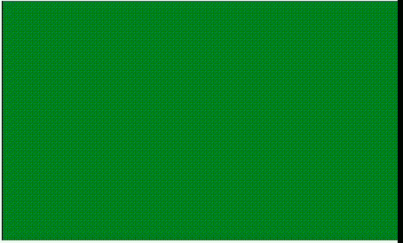

# p5.js |重绘()功能

> 原文:[https://www.geeksforgeeks.org/p5-js-redraw-function/](https://www.geeksforgeeks.org/p5-js-redraw-function/)

**draw()函数**用于一次性执行 draw()函数内的代码。该功能仅在必要时用于更新显示窗口。在 draw()函数内部调用时，redraw()函数不起作用。loop()和 noLoop()函数用于启用/禁用动画。

**语法:**

```
redraw( n )
```

**参数:**该功能接受单参数 **n** ，用于设置 n 次重绘。该函数的默认值为 1。

下面的例子说明了 p5.js 中的 redraw()函数:

**示例:**

```
let l = 0;

function setup() {

  // Create canvas of given size
  createCanvas(500, 300);

  // Set the background color
  background('green');

}

function draw() {

  // Set the stroke color
  stroke('black');

  // Function to draw the line
  line(l, 0, l, height);

}

function mousePressed() {
  l += 1;
  redraw();
}
```

**输出:**
