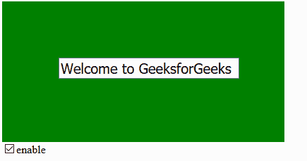
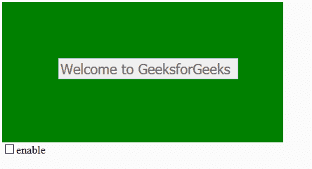

# p5.js | removeAttribute()函数

> 原文:[https://www . geesforgeks . org/P5-js-remove attribute-function/](https://www.geeksforgeeks.org/p5-js-removeattribute-function/)

**removeAttribute()函数**是一个内置函数，用于删除指定元素上的属性。
此功能需要 p5.dom 库。所以在**index.html**文件的头部增加下面一行。

## java 描述语言

```
<script language="javascript"
    type="text/javascript" src="path/to/p5.dom.js">
</script>
```

**语法:**

```
removeAttribute( attr )
```

**参数:**该功能接受单个参数 **attr** ，保存需要删除的属性值。
以下示例说明了 p5.js 中的 removeAttribute()函数:
**示例:**

## java 描述语言

```
var input_val;
var checkbox;
function setup() {

    // Canvas size 400*400
    createCanvas(400, 200);

    // Set background color
    background('green');

    // Create an input element with its value
    input_val = createInput('Welcome to GeeksforGeeks', true); 

    // Set the position of div element
    input_val.position(30, 80);

    // Set width of input field
    input_val.style('width', '250px');

    // Set font-size of input text
    input_val.style('font-size', '20px');

    // Set margin property
    input_val.style('margin-left', '50px');

    // Create a checkbox
    checkbox = createCheckbox('enable', true);

    // Set the status of checkbox
    checkbox.changed(enableInputText);
}

function enableInputText() {

   if (this.checked()) {

       // Re-enable the button
       input_val.removeAttribute('disabled');
   }
  else {

      // Disable the button
      input_val.attribute('disabled', '');
   }
 }
```

**输出:**

*   **点击启用复选框:**



*   **点击禁用复选框:**

