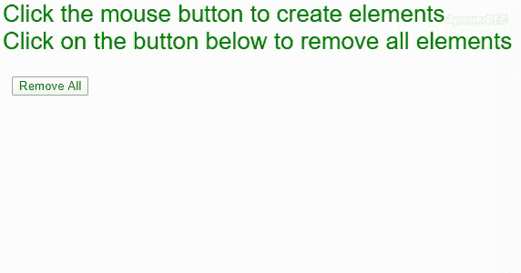

# p5.js | removeElements()函数

> 原文:[https://www . geesforgeks . org/P5-js-remove elements-function/](https://www.geeksforgeeks.org/p5-js-removeelements-function/)

**removeElements()** 功能用于移除当前由 p5 创建的所有元素，但使用 **createCanvas()功能**或 **createGraphics()功能**创建的元素除外。这些元素连同它们的事件处理程序一起从 DOM 中移除。

**语法:**

```
removeElements()
```

**参数:**该函数不接受任何参数。

下面的例子说明了 p5.js 中的 **removeElements()函数**:

**示例:**

```
function setup() {
  createCanvas(600, 300);
  textSize(26);
  fill("green")
  text("Click the mouse button to create elements", 10, 20);
  text("Click on the button below to remove all elements", 10, 50);

  // button to remove elements
  removeBtn = createButton('Remove All');
  removeBtn.position(20, 80);
  removeBtn.mousePressed(removeAll);
}

function mouseClicked() {
  // create element at mouse position
  createDiv('element').position(mouseX, mouseY);
}

function removeAll() {

  // remove all elements
  removeElements();
}
```

**输出:**


**在线编辑:**[【https://editor.p5js.org/】](https://editor.p5js.org/)
**环境设置:**[https://www . geeksforgeeks . org/P5-js-soundfile-object-installation-and-methods/](https://www.geeksforgeeks.org/p5-js-soundfile-object-installation-and-methods/)

**参考:**T2】https://p5js.org/reference/#/p5/removeElements