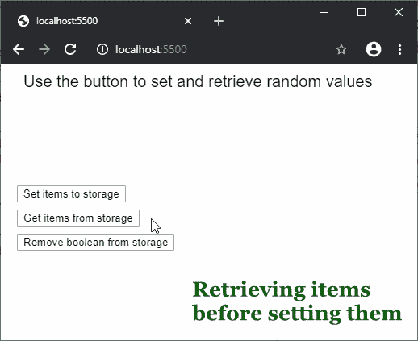

# p5.js | removeItem()功能

> 原文:[https://www.geeksforgeeks.org/p5-js-removeitem-function/](https://www.geeksforgeeks.org/p5-js-removeitem-function/)

**移除项目()**功能用于移除已使用**存储项目()功能**存储的项目。它从浏览器的本地存储中移除给定键名下的值。

**语法:**

```
removeItem(key)
```

**参数:**该函数接受一个参数，如上所述，如下所述。

*   **键:**这是一个字符串，表示必须删除其值的键。

下面的例子说明了 p5.js 中的 **removeItem()函数**:

**示例:**

```
function setup() {
  createCanvas(500, 300);
  textSize(20);
  text("Use the button to set and retrieve random values", 20, 20);

  setBtn = createButton('Set items to storage');
  setBtn.position(20, 150);
  setBtn.mouseClicked(setStorage)

  getBtn = createButton('Get items from storage');
  getBtn.position(20, 180);
  getBtn.mouseClicked(retrieveStorage)

  removeBtn = createButton('Remove string to storage');
  removeBtn.position(20, 210);
  removeBtn.mouseClicked(removeStorage)

}

function retrieveStorage() {
  clear();
  text("Use the button to set and retrieve random values", 20, 20);

  // retrieve values from local storage
  num = getItem('savedNumber');
  bool = getItem('savedBoolean');

  // display the values
  text("The retrieved items are:", 20, 50);
  text("Number: " + num, 20, 80);
  text("Boolean: " + bool, 20, 100);
}

function setStorage() {
  // generate random values
  randomNum = floor(random(100));
  randomBool = randomNum > 50 ? true : false;

  // store values to local storage
  storeItem('savedNumber', randomNum);
  storeItem('savedBoolean', randomBool);
}

function removeStorage() {

  // remove item from local storage
  removeItem('savedBoolean');
}
```

**输出:**


**在线编辑:**[【https://editor.p5js.org/】](https://editor.p5js.org/)
**环境设置:**[https://www . geeksforgeeks . org/P5-js-soundfile-object-installation-and-methods/](https://www.geeksforgeeks.org/p5-js-soundfile-object-installation-and-methods/)

**参考:**T2】https://p5js.org/reference/#/p5/removeItem