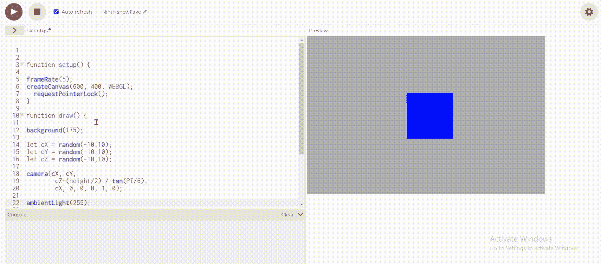

# p5.js requestpointerlock()函数

> 原文:[https://www . geesforgeks . org/P5-js-requestpointerlock-function/](https://www.geeksforgeeks.org/p5-js-requestpointerlock-function/)

函数 **requestPointerLock()** 用于将指针锁定到当前位置，然后使其不可见。所有浏览器都不支持此方法。它请求将指针锁定到一个 DOM 元素目标。

我们可以使用 movedX 和 movedY 来获得自上次调用 draw 以来鼠标移动的差异。

它使我们能够创建不依赖于鼠标移动的场景。

在锁定状态下，系统鼠标光标必须隐藏。鼠标的移动和按钮按压不得导致窗口失去焦点

**语法:**

```
requestPointerLock()
```

**示例:**

## java 描述语言

```
// Set the function
function setup() {

    // Set the frame rate  
    frameRate(5);

    // Set the canvas size
    createCanvas(600, 400, WEBGL);

    // Set the request pointer lock function 
    requestPointerLock();
}

// Set the draw function
function draw() {

    // Set the background colour
    background(175);

    // Set the camera
    let cX = random(-10, 10);
    let cY = random(-10, 10);
    let cZ = random(-10, 10);

    camera(cX, cY,
        cZ + (height / 2) / tan(PI / 6),
        cX, 0, 0, 0, 1, 0);

    ambientLight(255);

    rotateX(-movedX * 0.1);
    rotateY(movedY * 0.1);

    noStroke();
    normalMaterial();

    box(100, 100, 100);
}
```

**输出:**



在上面的例子中，我们可以看到指针变得不可见，当我们在代码中进行任何更改时，我们必须单击“Esc”按钮来再次使指针可见。