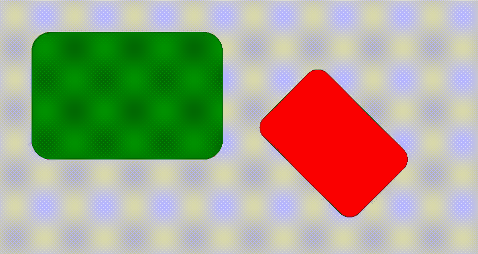
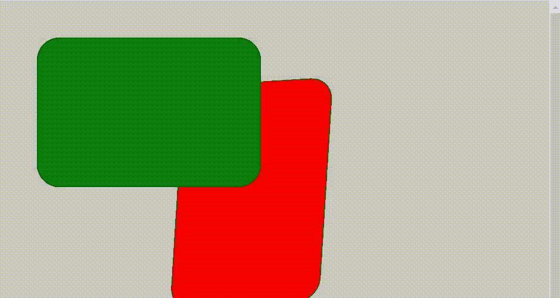

# p5.js resetMatrix()函数

> 原文:[https://www.geeksforgeeks.org/p5-js-resetmatrix-function/](https://www.geeksforgeeks.org/p5-js-resetmatrix-function/)

**resetMatrix()** 函数用于用单位矩阵(除对角线为 1 外所有值都为零的方阵)替换当前矩阵。当我们使用**应用矩阵()**旋转、平移和缩放任何图形图像时，然后通过应用函数**重置矩阵()**我们可以将图形更改为其原始形式。

**语法:**

```
resetMatrix()
```

下面是说明 resetMatrix()函数的例子。

**第一步:**打开在线网页编辑器**https://editor.p5js.org/.**

**第 2 步:**编写以下代码并运行查看输出。

**例 1:**

## java 描述语言

```
// Set up the function
function setup() {

    // Create canvas
    createCanvas(800, 400);
}

function draw() {

    // Set the background colour
    background(200);

    // Set the translate function
    translate(500, 50);

    // Set the apply matrix function
    applyMatrix(0.5, 0.5, -0.5, 0.5, 0, 0);

    // Set the colour to fill the graphics
    fill('red');

    // Set the shape.
    rect(50, 50, 300, 200, 30);

    // Now call the reset function
    resetMatrix();

    // Set the colour to fill the graphics
    fill('green');

    // Set the shape
    rect(50, 50, 300, 200, 30);
}
```

**输出:**



**例 2:**

## java 描述语言

```
// Set up the function
function setup() {

    // Create canvas
    createCanvas(800, 600);
}

function draw() {

    // Set the function to rotate
    let step = frameCount % 50;
    let angle = map(step, 10, 60, 0, PI);
    let cos_a = cos(angle);
    let sin_a = sin(angle);

    // Set the background color
    background(200);

    // Set the translate function
    translate(500, 50);

    // Set the apply matrix function
    applyMatrix(cos_a, sin_a, -sin_a, -cos_a, 0, 0);

    // Set the colour to fill the graphics
    fill('red');

    // Set the shape
    rect(50, 50, 300, 200, 30);

    // Now call the reset function
    resetMatrix();

    // Set the colour to fill the graphics
    fill('green');

    // Set the shape
    rect(50, 50, 300, 200, 30);
}
```

**输出:**

