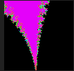

# p5.js resetShader()方法

> 原文:[https://www.geeksforgeeks.org/p5-js-resetshader-method/](https://www.geeksforgeeks.org/p5-js-resetshader-method/)

**p5.js resetShader()** 方法在**WEBLL**模式下恢复默认着色器。在此方法之后运行的代码不会受到先前定义的着色器的影响。

**语法:**

```
resetShader(kindOfShader)
```

**参数:**它接受*类着色器*作为可选参数，该参数是描述着色器类型的整数，可以是点、线或三角形。

**返回类型:**有空的返回类型。

下面的例子说明了 p5.js 中的 resetShader()函数:

## java 描述语言

```
let m;
function preload() {
    // Load the shader definitions from files
    m = loadShader('shader.vert', 'shader.frag');
}
function setup() {
    createCanvas(100, 100, WEBGL);
    // Use the shader
    shader(m);
    noStroke();
    m.setUniform('p', [-0.74364388703, 0.13182590421]);
    resetShader();
}

function draw() {
    m.setUniform('r', 1.5 * exp(-6.5 * (1 + sin(millis() / 2000))));
    quad(-1, -1, 1, -1, 1, 1, -1, 1);
}
```

着色器.绿色

```
precision highp float; varying vec2 vPos;
attribute vec3 aPosition;
void main() { vPos = (gl_Position = vec4(aPosition,1.0)).xy; }
```

**着色器。问**

```
precision highp float; varying vec2 vPos;
uniform vec2 p;
uniform float r;
const int I = 500;
void main() {
  vec2 c = p + vPos * r, z = c;
  float n = 0.0;
  for (int i = I; i > 0; i --) {
    if(z.x*z.x+z.y*z.y > 4.0) {
      n = float(i)/float(I);
      break;
    }
    z = vec2(z.x*z.x-z.y*z.y, 2.0*z.x*z.y) + c;
  }
  gl_FragColor = vec4(0.5-cos(n*17.0)/2.0,0.5-cos(n*13.0)/2.0,0.5-cos(n*23.0)/2.0,1.0);
}
```

**输出:**


在注释掉 *resetShader* ()方法后，输出如下。



**参考:**T2】https://p5js.org/reference/#/p5/resetshader