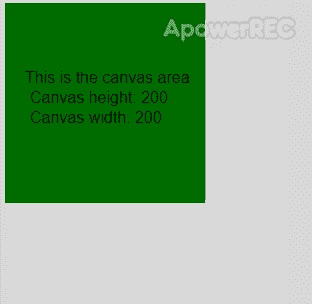
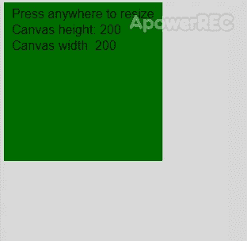

# p5.js | resizeCanvas()函数

> 原文:[https://www.geeksforgeeks.org/p5-js-resizecanvas-function/](https://www.geeksforgeeks.org/p5-js-resizecanvas-function/)

**resizeCanvas()** 功能用于将画布调整到参数给定的高度和宽度。除非可选的“无绘制”参数设置为真，否则在调整大小后画布会立即重绘。

**语法:**

```
resizeCanvas(w, h, [noRedraw])
```

**参数:**该功能接受三个参数，如上所述，描述如下:

*   **w:** 是表示新画布宽度的数字。
*   **h:** 是表示新画布高度的数字。
*   **no Draw:**这是一个布尔值，指定画布在调整大小时是否立即重绘。

下面的例子说明了 p5.js 中的 **resizeCanvas()函数**:

**示例 1:** 在本例中，我们固定了增加大小。

```
function setup() {
  createCanvas(200, 200);
  textSize(16);

  rect(0, 0, height, width);
  background('green');
  text("This is the canvas area", 20, 80);
  text("Canvas height: " + height, 25, 100);
  text("Canvas width: " + width, 25, 120);
}

function mouseClicked() {
  resizeCanvas(300, 300, true);

  rect(0, 0, height, width);
  background('green');
  text("This is the canvas area", 50, 130);
  text("Canvas height: " + height, 50, 150);
  text("Canvas width: " + width, 50, 170);
}
```

**输出:**

**例 2:** 在本例中，大小取决于点击位置。

```
function setup() {
  createCanvas(200, 200);
  textSize(16);

  rect(0, 0, height, width);
  background('green');
  text("Press anywhere to resize", 10, 20);
  text("Canvas height: " + height, 10, 40);
  text("Canvas width: " + width, 10, 60);
}

function mouseClicked(event) {
  // resize canvas to the
  resizeCanvas(event.x, event.y);

  rect(0, 0, height, width);
  background('green');
  text("Press anywhere to resize", 10, 20);
  text("Canvas height: " + height, 10, 40);
  text("Canvas width: " + width, 10, 60);
}
```

**输出:**


**在线编辑:**[【https://editor.p5js.org/】](https://editor.p5js.org/)
**环境设置:**[https://www . geeksforgeeks . org/P5-js-soundfile-object-installation-and-methods/](https://www.geeksforgeeks.org/p5-js-soundfile-object-installation-and-methods/)

**参考:**T2】https://p5js.org/reference/#/p5/resizeCanvas