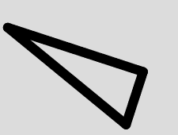

# p5.js | rotate()功能

> 原文:[https://www.geeksforgeeks.org/p5-js-rotate-function/](https://www.geeksforgeeks.org/p5-js-rotate-function/)

p5.js 中的**旋转()**功能用于*将使用 p5.js 的形状或对象旋转到指定的轴超过指定的角度*。

**语法:**

```
rotate(angle, [axis])

```

**参数:**该功能接受如上所述的单个参数，描述如下:

*   **角度:**以弧度或度数表示的旋转角度。
*   **轴:**要绕其旋转的轴

下面的程序说明了 p5.js 中的 rotate()函数:
**示例-1:**

```
function setup() {

    // Create Canvas of given size
    createCanvas(380, 170);
}

function draw() {

    // Set the background color
    background(220);

    strokeWeight(12);

    //set strokeJoin function
    strokeJoin(ROUND);

    // rotation function
    rotate(PI / 10.0);
    line(20, 30, 200, 30);
    line(200, 30, 200, 100);
    line(200, 100, 20, 30);
}
```

**输出:**


**示例-2:**

```
function setup() {

    // Create Canvas of given size
    createCanvas(380, 170);
}

function draw() {

    // Set the background color
    background(220);

    strokeWeight(12);

    // rotation function
    rotate(PI / 7.0);
    textSize(30);
    text("GeeksForGeeks", 50, 50);
}
```

**输出:**


**参考:**T2】https://p5js.org/reference/#/p5/rotate