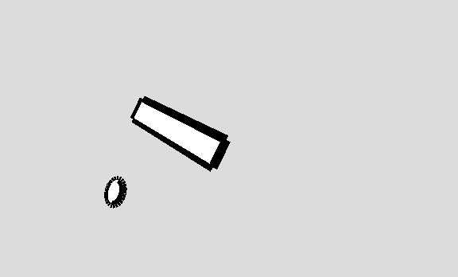
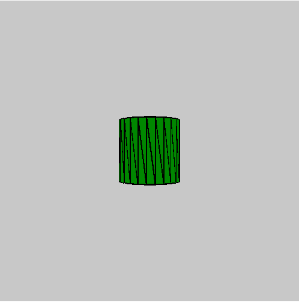

# p5.js | rotateY()功能

> 原文:[https://www.geeksforgeeks.org/p5-js-rotatey-function/](https://www.geeksforgeeks.org/p5-js-rotatey-function/)

p5.js 中的 **rotateY()函数**用于围绕 y 轴旋转形状或对象。

**语法:**

```
rotateY(angle)
```

**参数:**该功能接受单个参数**角度**，该参数存储旋转角度。

下面的程序说明了 p5.js 中的 rotateY()函数:

**示例 1:** 本示例使用 rotateY()函数围绕 y 轴旋转对象。

## java 描述语言

```
function setup() {

    // Create Canvas of given size
    createCanvas(650, 450, WEBGL);
}

function draw() {

    // Set the background color
    background(220);

    // Set stroke weight
    strokeWeight(12);

    // Rotation function
    rotate(PI / 7.0);

    // Call to rotateY function
    rotateY(millis() / 1000);

    // Create rectangle
    rect(3, 3, 200, 39);

    // Create ellipse
    ellipse(50, 150, 40, 40);
}
```

**输出:**



**示例 2:** 本示例使用 rotateY()函数围绕 y 轴旋转对象。

## java 描述语言

```
function setup() {

    // Create canvas of given size
    createCanvas(500, 500, WEBGL);
}

function draw() {

    // Set background color
    background(200);

    // Set property to rotate the
    // shape about the y-axis
    rotateY(frameCount * 0.01);

    // Set stroke weight
    strokeWeight(2);

    // Set fill color
    fill("green");

    // Draw of height 100 and radius 50
    cylinder(50, 100);
}
```

**输出:**



**参考:**T2https://p5js.org/reference/#/p5/rotateY