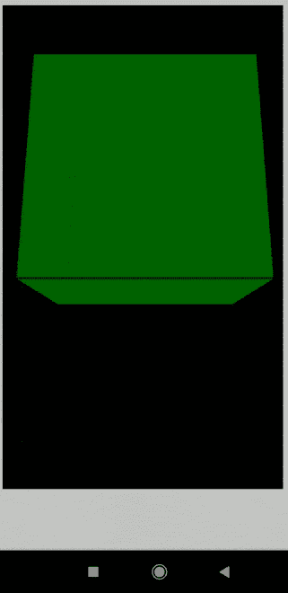
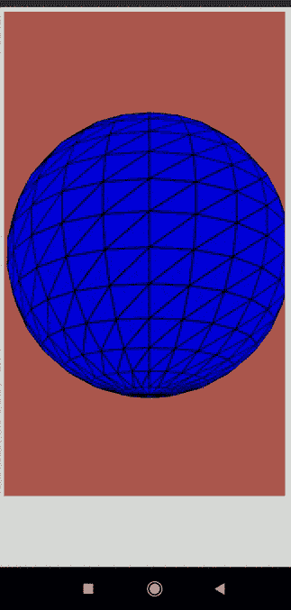

# p5.js 旋转 x 事件

> 原文:[https://www.geeksforgeeks.org/p5-js-rotationx-event/](https://www.geeksforgeeks.org/p5-js-rotationx-event/)

p5.js 中的系统变量 **rotationX** 负责移动设备(智能手机和平板电脑)始终沿着 x 轴的旋转。它可以在 draw()函数中使用，以连续获取当前沿 x 轴的旋转。如果图形角度模式()设置为度数，则该值将在-180 到 180 的范围内。当它被设置为 RADIANS 时，该值将是-PI 到 PI。

**注意:**如果三个变量一起使用，旋转的调用顺序很重要。需要按照 Z、Y 和 X 的顺序调用它们，以防止不一致。

**语法:**

```
rotationX
```

**例 1:**

## java 描述语言

```
// Rotate the the device to see the box move
function setup() {
  createCanvas(600, 600, WEBGL);
}

function draw() {
  background("white");

  text(rotationX, 20, 20);

  // Set the rotation to be equal to
  // the variable rotationX
  rotateX(radians(rotationX));

  fill("blue");
  box(200, 200, 200);
}
```

**输出:**



**例 2:**

## java 描述语言

```
function setup() {
  createCanvas(600, 600, WEBGL);
}

function draw() {
  background(2);

  // Set the rotation to be equal to
  // the variable rotationX
  rotateX(radians(rotationX));

  background(205, 102, 94);

  fill("blue");
  sphere(140);
}
```

**输出:**

